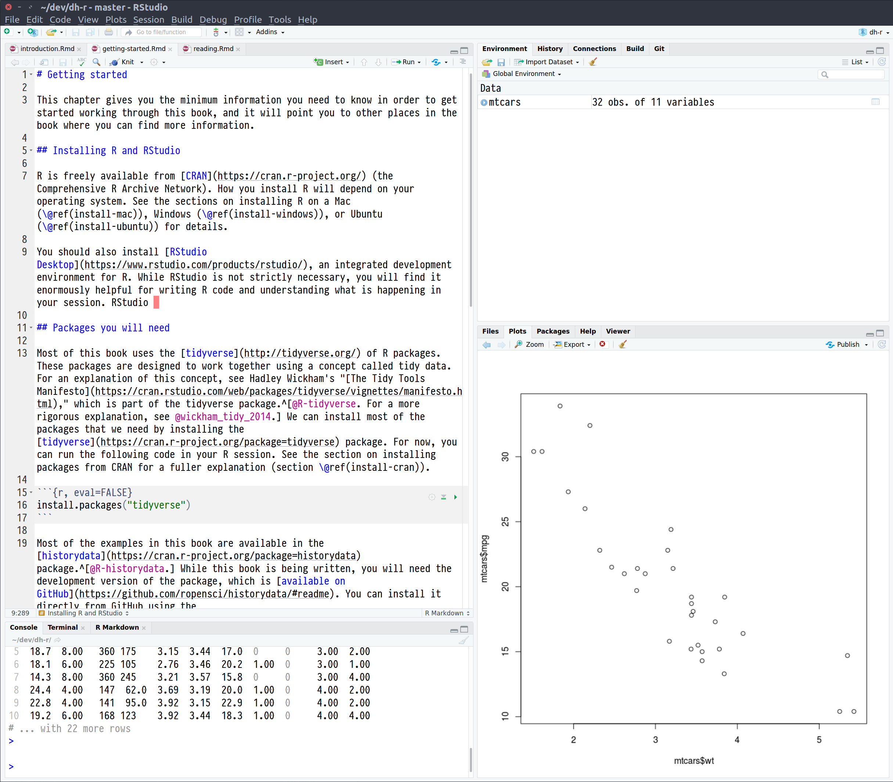

```{r include=FALSE, cache=FALSE}
set.seed(4356)
options(digits = 3)

knitr::opts_chunk$set(
  comment = "#>",
  collapse = TRUE,
  cache = TRUE,
  out.width = "100%",
  fig.align = "left",
  fig.width = 8,
  fig.asp = 0.618,  # 1 / phi
  fig.show = "hold"
)

options(dplyr.print_min = 6, dplyr.print_max = 6)
```
# Getting started

This chapter gives you the minimum information you need to know in order to get started working through this book, and it will point you to other places in the book where you can find more information. 

## Installing R and RStudio

R is freely available from [CRAN](https://cran.r-project.org/) (the Comprehensive R Archive Network). How you install R will depend on your operating system. See the sections on installing R on a Mac (\@ref(install-mac)), Windows (\@ref(install-windows)), or Ubuntu (\@ref(install-ubuntu)) for details.

You should also install [RStudio Desktop](https://www.rstudio.com/products/rstudio/), an integrated development environment for R. While RStudio is not strictly necessary, you will find it enormously helpful for writing R code and understanding what is happening in your session. It contains tools for editing R code and documents, running code in an R console, viewing plots, keeping your code under version control, and inspecting your R session.

```{r, echo=FALSE, fig.cap="The RStudio IDE being used to edit a project. (This book, in fact!)"}

```

Once you have R and RStudio installed, there are some basic configuration options which are helpful to set (see section \@ref(configure-r)).

## Packages you will need

Most of this book uses the [tidyverse](http://tidyverse.org/) of R packages. These packages are designed to work together using a concept called tidy data. For an explanation of this concept, see Hadley Wickham's "[The Tidy Tools Manifesto](http://tidyverse.tidyverse.org/articles/manifesto.html)," which is part of the tidyverse package.^[@R-tidyverse. For a more rigorous explanation, see @wickham_tidy_2014.] We can install most of the packages that we need by installing the [tidyverse](https://cran.r-project.org/package=tidyverse) package. For now, you can run the following code in your R session. See the section on installing packages from CRAN for a fuller explanation (section \@ref(install-cran)). 

```{r, eval=FALSE}
install.packages("tidyverse")
```

Most of the examples in this book are available in the [historydata](https://cran.r-project.org/package=historydata) package.^[@R-historydata.] While this book is being written, you will need the development version of the package, which is [available on GitHub](https://github.com/ropensci/historydata/#readme). You can install it directly from GitHub using the [devtools](https://cran.r-project.org/package=devtools) package by running the code below. See the section on installing packages from GitHub for a fuller explanation (section \@ref(install-github)).

```{r, eval=FALSE}
install.packages("devtools")
devtools::install_github("ropensci/historydata")
```

You can test that you have these packages installed by loading them in your R session. Note that tidyverse prints a message about the other packages that it is loading, but this is not an error message. See the section on packages and libraries for more information about loading packages (section \@ref(packages-libraries)).

```{r}
library(historydata)
library(tidyverse)
```

You will need other packages for different chapters in this book. You can install them from CRAN as you go. See the package guide for a description of other packages that may be helpful to you (appendix \@ref(package-guide)).

## Learning R

This book is not intended to teach you how to program in R. If you want a general purpose introduction to the language, I recommend the following sequence of books.

- Hadley Wickham and Garret Grolemund's [*R for Data Science*](http://r4ds.had.co.nz/) teaches some of the basics of R programming in the process of teaching data analysis. If you have already programmed before, this is the place to start.^[@wickham_r_2017.]
- Hadley Wickham's [*Advanced R*](http://adv-r.had.co.nz/) is the definitive guide to the language. Once you have a journeyman's proficiency in R, use this book to gain a deeper knowledge.^[@wickham_advanced_2014.]

This book does offer an R primer (appendix \@ref(primer)). This will explain the very basics of R in a condensed form. This should be enough to get you started, especially if you are already familiar with programming concepts from a different language. 
