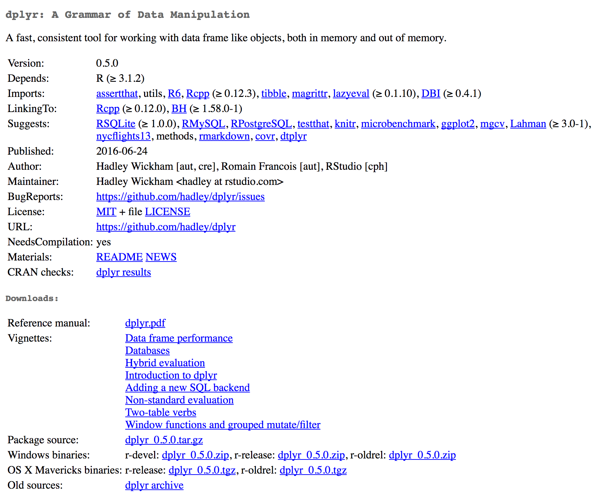
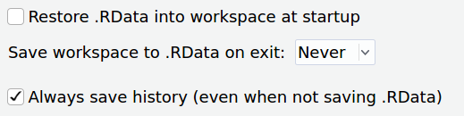

# (APPENDIX) Appendices {-}

# Installing R and packages

## What is CRAN?

R has very good support on the three main platforms: Linux, MacOS, and Windows. Both R and the language and the thousands of published packages which extend its functionality for the most part work across the three platforms. In addition, installing packages in R can be considerably simpler than in other languages. Much of the ease of installing R and add-on packages is thanks to the CRAN infrastructure.

R and the published packages are available at [CRAN](https://cran.r-project.org/), the "Comprehensive R Archive Network." The CRAN maintainers rigorously screen new packages, then test all accepted packages continually. This does not mean that there are no bugs in published R packages, but it does mean that the quality of software published at CRAN is generally higher than in the software repositories of other programming languages.

CRAN is a collection of mirrors, that is, servers that contain the exact same content.  The canonical URL for CRAN is `https://cran.r-project.org/`, but you can also access a CRAN mirror at Indiana University, for example, at `https://ftp.ussg.iu.edu/CRAN/`. The R Project maintains a [current list of mirrors](https://cran.r-project.org/mirrors.html). When installing packages at the start of an R session, R will ask you which mirror you want to use. Unless you have a compelling reason to pick a different one, you should select the first option, "Cloud": `https://cloud.r-project.org/`. That option will pick a server which is geographically close to you. If you add the following line to the `.Rprofile` file in your user's home directory (`~/.Rprofile` on Mac and Linux), then you can set that option permanently.

```{r eval=FALSE}
options(repos = c(CRAN = "https://cloud.r-project.org"))
```

## Installing R on MacOS {#install-mac}

CRAN compiles R for the Mac. To install R, go to [CRAN](https://cran.r-project.org/) and click on the link to [download R for Mac](https://cran.r-project.org/bin/macosx/). Download the installer for the current version of R, for example, `R-3.3.2.pkg`. Install this package like you would any other Mac software. The installer will install R, plus various other software such as a GUI application for R.

You can test that you have R installed properly by opening the Terminal program on your Mac.

```
R --version
```

If you get a message that prints the current version of R, then you have successfully installed R.

In general, you should use the version of R that CRAN compiled for the Mac unless you have a specific reason not to do so. One of the chief advantages of this version is that you can install R extension packages which have been pre-compiled by CRAN for the Mac. This can make it significantly easier to install R packages.

You can however install R via Homebrew. [Homebrew](http://brew.sh/) is a package manager for the Mac which lets you install and update software from the command line. You might want to install R this way if you plan on compiling your own R packages, or want to try to optimize the linear algebra library which lets R perform matrix operations quickly.

First follow the instructions to install [Homebrew](http://brew.sh/) on its website. Then in your terminal, run the following commands. These add a list of science-related packages to the list of software that Homebrew knows how to install, and installs R. This will probably involve installing a lot of additional software, such as compilers.^[For a fuller explanation of installing R via Homebrew, see [Bob Rudis's post](http://rud.is/b/2015/10/22/installing-r-on-os-x-100-homebrew-edition/) on the topic.]

```
brew tap homebrew/science
brew install R
```

You can see the various options for installing R via Homebrew by running `brew show R` in the terminal. For instance, using certain flags you can change the linear algebra system that R is compiled against. If you install R with Homebrew, you may also need to install various system libraries, such as `libxml2` or `libcurl`.

## Installing R on Ubuntu {#install-ubuntu}

Being able to install R on a Linux system is useful in several ways. Of course, if your primary computer runs a Linux distribution, then you can use R on it like you would on Mac or Windows. But you can also install R on a Linux server, or run R on a Linux virtual machine hosted on a different operating system. These instructions give you the commands for installing R on either the server or desktop version of Ubuntu 16.04.x, the latest long-term support (LTS) version of a popular Linux distribution.^[For a fuller explanation of how to install R on Ubuntu, see the [official instructions on CRAN](https://cran.r-project.org/bin/linux/ubuntu/README.html) or [Digital Ocean's guide](https://www.digitalocean.com/community/tutorials/how-to-install-r-on-ubuntu-16-04-2).]

Software on Ubuntu is generally installed via the apt package manager. A version of R is available in the Ubuntu repositories, but it it almost certainly not the most recent versions, especially in LTS versions of Ubuntu. Therefore it is best to add a CRAN-maintained Ubuntu repository to the list of software sources that apt checks, then install R.

First, run this command (and all following commands) in the Ubuntu terminal. This command gets the security key to verify the software.

```
sudo apt-key adv --keyserver keyserver.ubuntu.com --recv-keys E298A3A825C0D65DFD57CBB651716619E084DAB9
```

Then add the CRAN maintained Ubuntu repository.

```
sudo add-apt-repository 'deb https://cran.rstudio.com/bin/linux/ubuntu xenial/'
```

Finally install R. In addition to installing R, these commands will install the Ubuntu packages that you need to be able to compile R extension packages for yourself.

```
sudo apt update
sudo apt install r-base r-base-dev
```

If you can run the following command and get the correct version of R, then you have installed R correctly.

```
R --version
```

Many R packages will require common Ubuntu packages for development before they can be installed. Installing these will set up your system with the correct libraries for common R packages.

```
sudo apt install build-essential libcurl4-openssl-dev libssl-dev libxml2-dev
```

## Installing R on Windows {#install-windows}

CRAN maintains a version of R for Windows, including a GUI, along with helpful documentation on how to install it. Follow the instructons on the [CRAN download page for Windows](https://cran.r-project.org/bin/windows/base/).

The version of R that you install from CRAN for Windows will be able to install binary (i.e., precompiled) versions of R extension packages. This is considerably easier than trying to compile those packages yourself. However, CRAN also maintains a set of [Rtools for Windows](https://cran.r-project.org/bin/windows/Rtools/) which provide the software that you will need to compile packages for yourself. If you wish to build packages from source, then install the version of Rtools that corresponds to the version of R you have installed.

## About R packages and libraries {#packages-libraries}

CRAN hosts many packages for R. These packages extend R's functionality by providing additional functions. And R packages can also include data files, which is an easy way to distribute example data or data for learning that is not too large.^[For an explanation of how R packages are created, see @wickham_r_2015.]

These extensions to R are called **packages**. In other programming languages they might be called libraries. But in R, the term **library** is used for the directories where R packages are installed. It is important to remember that R can load packages from multiple libraries at a time. You can see which libraries your R session knows about with the function `.libPaths()`.

```{r}
.libPaths()
```

The second library in that list of directories is the library that comes bundled with R. It includes packages like the stats and utils packages which provide basic functionality to R. This library is kept in a system directory and is available to all users of R on a system.

The first library in that list is a personal package library. It is kept inside the user's home directory, in this case, the user `lmullen`. This library contains packages which the user has installed, and they are only accessible to that user. When you load a package with `library()` or `require()`, those functions look for a package in the first directory returned by `.libPaths()`, then the second and so on, stopping when it finds the first match. This ensures that versions of packages that you install are loaded in preference to system libraries. When installing packages for the first time, you will probably be prompted to create a personal package library.^[There are other places that R libaries can be kept. For example, the [packrat](https://cran.r-project.org/package=packrat) package can add a library to a project directory.]

## Installing packages from CRAN {#install-cran}

Any package on CRAN can be installed using the `install.packages()` function.

```{r install, eval=FALSE}
install.packages("tokenizers")
```

You can install multiple packages by passing a vector of package names to the function, for example, `install.packages(c("dplyr", "stringr"))`.

That function will install the requested packages, along with any of their non-optional dependencies. Unless you have configured your system differently, the packages will be installed in a personal package library somewhere in your home directory.

Once you have installed packages, you can check for updates by running the `update.packages()` command. This will check CRAN for newer versions of the packages that you have already installed, and it will prompt you to install any that have been updated.

If you have a version of R that supports it---namely Windows and the CRAN compiled R for some versions of MacOS---then `install.packages()` will install a binary version of packages if one is available.^[You can see whether your version of R supports binary packages by checking an option: `getOption("pkgType")`. If the result is `"both"`, then you can install both binary packages and packages from source. If the result is `"source"`, then you can only install packages from source.] When packages are installed from source, R creates a version which can be installed and used directly. Many R packages contain code written in a lower-level language, such as C++. When installed from source, those packages must be compiled into a binary. If possible, `install.packages()` will install a pre-compiled binary from R.

If a binary version of a package is not available for your version of R, then `install.packages()` will compile the package for you. This will require you to have a compiler and possibly system libraries installed. The instructions on installing R above will show you how to get those dependencies for your operating system. Certain packages may require you to install system libraries. For instance the [rgdal](https://cran.r-project.org/package=rgdal) package, used for geospatial analysis, requires the [GDAL/OGR libraries](http://www.gdal.org/). These can be installed on a Mac via Homebrew with the command `brew install gdal` and on Ubuntu with the command `sudo apt install gdal-bin libgdal-dev`. Until these libraries are installed, the package will fail to compile.

Each package that CRAN publishes has a page that lists information about the package. This information includes a README which usually explains how to get started with the package, a manual that has documentation for each function and dataset in a package, often vignettes which explain some aspect of using the package, along with the name of the package maintainer, where bug reports can be filed and so on. For example, here is the CRAN page for the [dplyr](https://cran.r-project.org/package=dplyr) package.

```{r, echo=FALSE, fig.cap="CRAN listing for the [dplyr](https://cran.r-project.org/package=dplyr) package."}

```

The CRAN page also lets us know how a package can be installed. In this case we can see that [dplyr](https://cran.r-project.org/package=dplyr) requires compilation.  But we can also see that pre-compiled binaries are available for Windows and Mac. If external system libraries were required, they would be listed under `SystemRequirements`, with some indication about how those requirements could be met on different platforms.

## Installing packages from GitHub {#install-github}

Not all R packages are published to CRAN. Sometimes they are not suitable for CRAN, or are unfinished. Other times you may wish to install the development version of a package, even if a stable version is available on CRAN.

Many R developers keep a version control repository of their packages on GitHub. For example, the [historydata](https://cran.r-project.org/package=historydata) package has a [repository on GitHub](https://github.com/ropensci/historydata). (These repositories are generally listed on a published package's CRAN page.) We could install [historydata](https://cran.r-project.org/package=historydata) from CRAN if we wished, but the development version has additional datasets which have not yet been published.

We can install [historydata](https://cran.r-project.org/package=historydata) from GitHub using the [devtools](https://cran.r-project.org/package=devtools) package. First install that package if necessary. Then using the name of the user and the GitHub repository, in this case `ropensci/historydata`, we can install the development version of [historydata](https://cran.r-project.org/package=historydata).

```{r, eval=FALSE}
# install.packages("devtools")
devtools::install_github("ropensci/historydata")
```

Note that once you have installed a package from GitHub, R will not keep it updated with `update.packages()` unless the package is published to CRAN with a more recent version number than the package you installed from GitHub. You can, however, reinstall the package from GitHub if there are changes that you want to pick up.

## Configuring R {#configure-r}

R is both a programming langauge and an interactive environment for data analysis. R users spend more of their time using the interactive environment than users of most other languages. R thus tries to save your variables, plots, and the like (called an environment) when you close your session. Then it tries to reload that environment when you create a new session. This seems desirable for new users, but it breeds very bad habits. It teaches you to just use the variables in your environment, rather than ensuring that you write scripts which can reproduce your results from raw data to finished project. I strongly recommend that you disable this default behavior.

If you are using RStudio, you can go to `Tools > Global Options > General` and make sure that you set your options as in the figure below.

```{r, echo=FALSE, fig.cap="To make sure that R does not save your environment between sessions, change these options in RStudio."}

```

If you are using R at the command line (which you will probably want to do at some point), you can start your session with these flags:

```
R --no-save --no-restore-data
```

You may choose to set a alias in Bash or your preferred shell to ensure that yo always start R this way.

```
alias R="R --no-save --no-restore-data --quiet"
```
