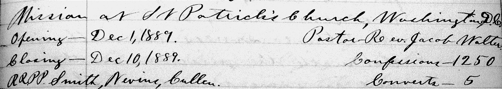
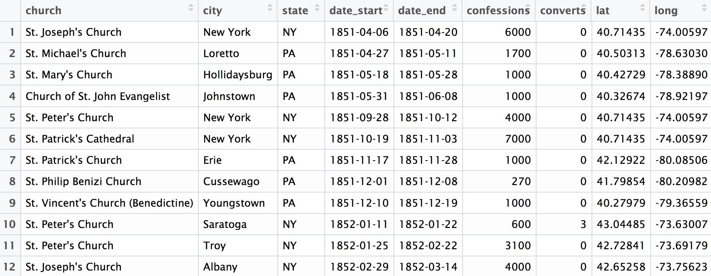
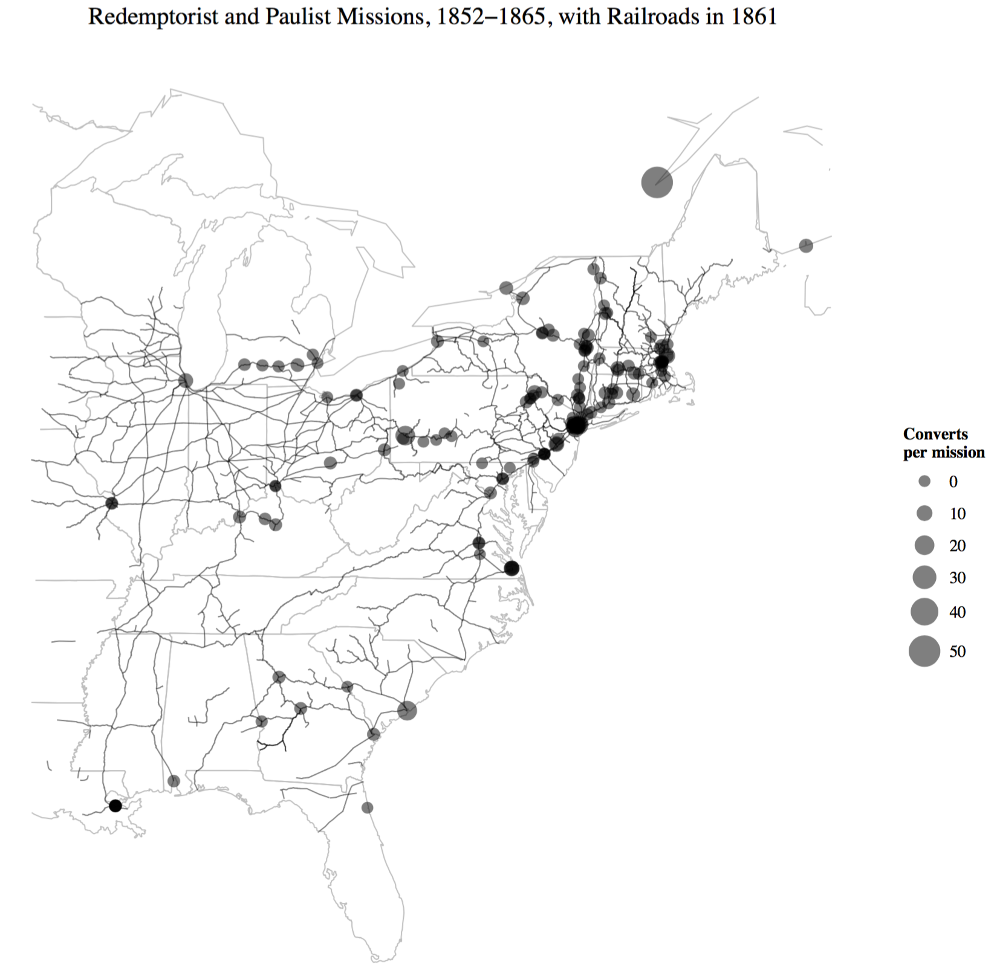
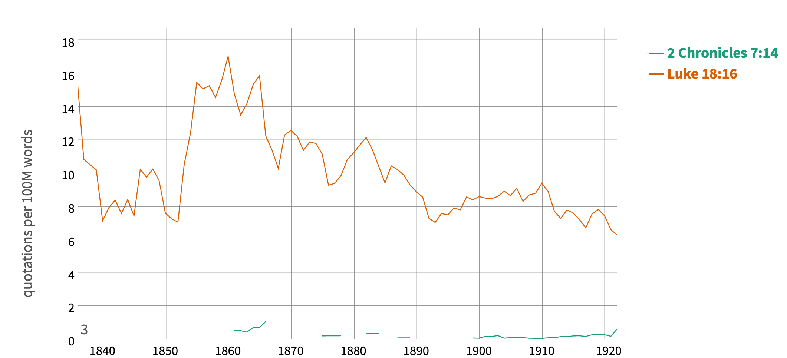

# Introduction

## Multiply your ways of knowing

The best advice a historian ever gave me about historical methods was this: "Multiply your ways of knowing."^[That historian is David Hackett Fischer, author of -@fischer_historians_1970.] That advice gets to the heart of how historians do their work. Historians are methodologically omnivorous. In their pursuit of historical knowledge, they are willing to study any body of sources and to apply any way of reading them that they can devise, so long as those sources and methods produce insight into past. The history of the historical profession can be understood in broad outlines as a series of developments in what sources historians chose to look at and how they went about studying them. Political history was succeeded by social history was succeeded by cultural history, and in each instance historians paid attention to new sources and devised new ways of analyzing them. Yet newer methods and concerns never completely displace older ways of knowing about the past, even if findings from new methods invalidate some of the conclusions of the older methods. On the whole the historical discipline is on a sounder footing the more it multiplies the ways in which it can learn about the past.

Going back at least to the 1960s, and gaining new life in recent years, historians have used computation as a means of multiplying their ways of knowing about the past.^[@thomas_iii_computing_2004.] As with other historical methods, once you have gained a familiarity with computational history, you will see historical sources in a new way. 

Let me give an example using some data that I gathered in the course of more traditional historical research. The Paulist Fathers, an order of Catholic missionary priests, kept a *Chronicle* of their missions across the United States during the nineteenth century.^[*Chronicle of the Missions Given by the Congregation of Missionary Priests of St. Paul the Apostle*, six manuscript volumes, Paulist Fathers Archives, New York, NY.] These six manuscript volumes contain over a thousand pages of narrative recollections and anecdotes about the missions the Paulists preached. Any historian would know what to do with those narrative portions, though some historians might pay attention to social relations, others to the gendered aspects of the missions, others to the content of their preaching.

At the head of each entry the Paulists recorded statistics of the missions, as in the image below. It would be easy to ignore these statistics, or to mention the numbers for a mission here or there without ever doing anything systematic with them.

```{r, echo=FALSE, fig.cap="The statistics for a Paulist mission held in Washington, DC, in 1889. Note the dates, location, number of confessions, and number of conversions."}

```

These statistics were scattered over a thousand pages. But once transcribed, the resulting table of data offered an overview of the cities in which missions were held, their dates, the number of confessions the Paulists heard, and the number of converts they made. From there the locations mentioned in the Paulist chronicle could be geocoded, so that latitudes and longitudes were associated with place names. 

```{r, echo=FALSE, fig.cap="The first few rows of a data table transcribed from the Paulist missions. Note that each piece of significant information from the manuscript record has become its own column in the table."}

```

With that table of data, it is possible to create many kinds of visualization. One might, for instance, check the relationship between the duration of the missions and the number of converts the Paulists made, or ask which states had the most converts. After analyzing the data that way, it became apparent which bishops supported the Paulist missionary efforts. After also finding the data for the historic state boundaries and railroad locations, it is possible to create a map like the one below, in order to understand the spatial patterns of Paulist missions.[@thomas_iii_railroads_2006; @long_atlas_2010]

```{r, echo=FALSE, fig.cap="Redemptorist and Paulist missions from 1852 to 1865. Note that there are three kinds of spatial data in this map: the transcribed missions data with city locations, the historical state boundaries, and the railroad network."}

```

In this instance a prior knowledge of what was possible with computational history let us see our sources differently. Latent in the manuscript *Chronicle* was a table of data. What might have been just a useful collection of anecdotal details *also* became a quantitative and spatial dataset which let us examine the larger patterns of Paulist missions. By multiplying our ways of knowing, we learned more about the Paulists than we otherwise would have. 

Once you are familiar with what you can do with these kinds of historical methods, you will start seeing many sources differently. The aim of this book is to teach you how to think historically with computational methods.

## What is computational history?

For the purposes of this book, **computational history** will mean analyzing and visualizing historical data using a computer programming language, either to explore that data or to advance historical arguments from it.^[This definition roughly aligns with the subject matter of other books on the topic, including @graham_exploring_2015; @arnold_humanities_2015; @afanador-llach_programming_2017; @jockers_text_2014.] For historians that kind of data analysis has most often meant spatial analysis, text analysis, and network analysis, though it could also include sound analysis and image analysis. Those broad domains share many analytical techniques in common. The patterns you learn for one will often apply to another.

Historical sources are treated as data when we look for larger patterns by studying them in the aggregate without the preliminary step of examining or reading the sources one by one. Treating sources as data usually implies that at some intermediate point in the process of analysis we treat them as numbers. For example, places might be reduced latitudes and longitudes, and texts might be reduced to tokens. Many of the methods of computational history have a mathematical underpinning, and understanding the basic principles of those mathematics is essential to responsibily using those methods.[@juola_six_2017]  However it is relatively rare for computational historians to develop new methods; most often, they use or adapt methods created by other disciplines.

The goal of computational history, however, is rarely to reduce our findings to a number. They certainly do not attemp to solve the past, the way one might solve a mathematical puzzle. Usually historians are looking for a complex form of insight into the past, an insight which is compatible with, if different from, the kinds of knowledge which can be gained from more traditional methods of historical research such as close reading. Computational history can often take the form of exploratory analysis. But it also can advance historical interpretations or make historical arguments, whether on its own or when mixed with traditional methods. One of the key aims of this book is to show how such patterns of computational historical argument work and how you can apply them to your own research.^[On the place of argument in digital history, see @arguing_with_digital_history_working_group_digital_2017, especially part 4.]

Though this kind of research does not absolutely require computer programming, computer programming in a language with the libraries to support data analysis is the most effective and reliable means of doing such work. While you could do some of the work described in this book with, say, Excel, this book will teach you the [R programming language](https://www.r-project.org/).[@R-base]

Computational history is a particular kind of work one can do within the much larger domains of digital history. For example, creating or using a content management system like [Omeka](https://omeka.org/) to manage historical sources is a kind of digital history but not a kind of computational history. A visualization of the metadata in that content management system would be a kind of computational history, however. What matters is not the specific action (computer programming) as the the kinds of sources and methods applied to them.

Computational history is most easily defined by giving examples of the kinds of things that one can do with it. Consider these few examples of historical sources and methods:

- Given lists of members of different organizations, you create a network graph of shared membership between organizations to reveal the social structure of a community.

- Given the WPA former slave narratives, you extract all of the places mentioned using natural-language processing, in order to create a spatial index and map of the narratives.

- Given all of the religious tracts published in the nineteenth century by the American Tract Society, you create a topic model of how the subjects of those tracts changed over time. You also create a word-embedded model to explore the relationship between the vocabulary in the corpus.

- Given a set of price data, you create a chart of changing prices over time. You also create a function which can adjust prices for inflation to compare them over time.

These brief descriptions of potential computational history projects emphasize the sources and methods you might use. But sources and methods are the means by which historians get to arguments or interpretations of the past. And so computational history is not just a collection of methods; it is a way of asking and answering historical questions. The patterns or structure of this way of historical thinking is the subject of part 1 of this book.

## Why computational history?

Computational methods offers historians the same advantage of as any other historical method: a different way of seeing sources, and thus of interpreting the past. There a several specific ways in which computational history offers new angles of vision.

The most important is **scale**. Historians do their work at many different scales, from the individual life in biography, to the single event or community in microhistory, to structural history over *la longue durée* as in the *Annales* School.^[For a recent call for a return to long-term history, see @guldi_history_2014.] Computational methods allow historians to examine many more sources than they could ever read, and so to uncover trends which they would not otherwise be able to see. Consider, for example, the work of Tim Hitchcock and William Turkel studying _The Old Bailey Proceedings_. By text mining nearly 200,000 trial transcripts comprising some 127 million words over nearly two and half centuries, they were able to demonstrate major changes in the practice of British criminal trials and identify the beginning of plea bargaining in those courts.[@hitchcock_old_2016]

Computational methods help historians not only at the large scale, but also at smaller scales. Once you have charted the macroscopic trends, you are free to use computational methods as a discovery tool for more detailed analysis. For instance, having uncovered the networks of text borrowing, you can then read individual texts systematically because you are better informed about their relationship to one another. Computational history is not so much a replacement for traditional historical methods as it is a way of directing your attention when using those methods. A key reason to use computational history is the ability to move back and forth between different scales of historical analysis.^[A foundation text in computational history offers a valuable discussion of the importance of scale. See @graham_exploring_2015, pp. 1--2, ch. 1.]

Computational methods also reveal **historical structures**. In the *[Viral Texts](https://viraltexts.org/)* project, for example, scholars examined how nineteenth-century U.S. newspapers reprinted texts from one another in millions of newspapers. Any scholar with two newspapers could identify an example or two of reprinting. A literary historian with a database and some diligence in searching could possibly recover the reprinting history of a single text. But it took computational methods for the *Viral Texts* team to uncover large-scale patterns of reprinting.^[@cordell_reprinting_2015; @smith_computational_2015.] Those patterns as revealed in the team's network graphs comprise the structure of newspaper reprinting in the nineteenth-century. Scholars have long known that there was such a structure, but *Viral Texts* reveals that structure in detail. Knowing that there is a network and knowing what the network is are different kinds of historical knowledge.

Another advantage of computational methods is that they help historians not just to frame different questions, but to **frame questions** differently. Sometimes historians start by reading a body of sources, then draw up their questions on the basis of that reading. More often historians frame a historical question then go find the sources that can help them to answer it. Historians iterate back and forth between exploring sources and framing questions. 

Computational history is a way of encouraging that cycle by providing a check on the historian's imagination or prior knowledge. Consider an example of a project where a computational approach overturned my prior (and seemingly well founded) assumptions about a body of sources. For *[America's Public Bible](http://americaspublicbible.org/)*, I wrote a program to count up how frequently Bible verses were quoted in nineteenth-century U.S. newspapers. Before seeing the results, I assumed that verses often used to support the idea of Christian nationalism would be among the most quoted. After all, religious historians have written a great deal about the origins of Christian nationalism in the United States, and newspapers were a logical place to advance those ideas. With that knowledge, I could have framed a question about the role of those texts (e.g., 2 Chronicles 7:14; Proverbs 14:34; Psalm 33:12). Had I searched the *[Chronicling America](http://chroniclingamerica.loc.gov/)* collection of newspapers for those texts, I would certainly have found what I was looking for. Search is able to find examples of what I already knew to look for, but could not put the results in any kind of large-scale context.^[Cf. @putnam_transnational_2016.]

But when I computed how frequently every Bible verse was used, I found that those "Christian nationalist" verses were insignificant compared to many other texts: not only did they not appear in the top ten verses, they barely appeared in the top thousand verses. Nor could I have predicted what the most frequently used verses actually were. The most commonly used texts were "Suffer little children to come unto me, and forbid them not" (Luke 18:16; Matthew 19:14), because newspapers often published Sunday school lessons. The chart below gives an idea of the difference in popularity between those Sunday school texts and the "Christian nationalist" texts.^[@mullen_americas_2018.]

```{r, echo=FALSE, fig.cap='A comparison of the popularity of Luke 18:16 ("Suffer little children to come unto me ...") and 2 Chronicles 7:14 ("If my people, which are called by my name, shall humble themselves ...") in nineteenth-century U.S. newspapers. From *America\'s Public Bible* <<http://americaspublicbible.org>>.'}

```

In other words, even for a period and topic on which I was already familiar, I was unable frame a historical question that bore any reasonable relationship to the actual prevalence of biblical verses in U.S. newspapers. But the results of my computational analysis showed me which questions I needed to frame in a more rigorous way. Now I could investigate why some verses were popular, or why they declined or grew or spiked in popularity. Computational history can discipline the way that we frame our questions, by directing our attention to what was historically typical in a measured way. Historians are often quite brilliant at finding the perfect illustrative anecdote. Computational history is more prosaic, because it is better at uncovering the typical detail rather than the telling detail. Yet knowing what is typical and what is not is a crucial piece for keeping our interpretations of the past grounded in the sources and not driven to and fro by our own anachronistic assumptions.

As an aside, this kind of disciplined question framing is not a capitulation to positivism. Because computational historians often use measurements as evidence, they are sometimes accused of thinking that the only kind of evidence is measurements. For most computational historical work, that accusation is simply groundless. The key is that the measurements are often treated as questions rather than answers. To continue the example from above, "Luke 18:16" was not the definitive answer to the question. Rather the question became, "Why Luke 18:16 instead of 2 Chronicles 7:14?" This leaves ample room for humanistic question framing and answering, and no room at all for positivism.

Computational history also **makes sources legible** for study which would otherwise not be used. Quantitative sources almost by definition require some kind of computation, and historians have been using those kinds of sources in a serious way since at least the 1960s. Sources like the U.S. Census or the records of membership in religious denominations become available to historians who are able to compute on them. To give another example, geographic data---or even just sources that mention places---can be opened up once one is able to make maps. Consider Cameron Blevins's approach to the region and imagined geographies in his [study of Houston newspapers](http://web.stanford.edu/group/spatialhistory/cgi-bin/site/pub.php?id=93). Blevins was able to count up the places mentioned in those newspapers and then chart and map their frequency. Any historian could read those newspapers---though they would almost certainly skip over the advertisements or freight tables, which become legible using Blevins's approach---but it was computation and mapping which turned that raw data into something meaningful to a historian. ^[@blevins_space_2014; @blevins_mining_2014.] 

Finally, computational history can enable **presentations of historical arguments that are interactive and iterative**. Many of the methods discussed in this book lend themselves to visualization, and many of them allow the historian to iteratively explore data and come to better questions or fuller answers. While the focus of this book is not on creating interactive websites or novel forms of visualization, it will demonstrate how to take an interactive approach to computational history and how to visualize historical findings. 

## How to learn computational historical thinking

At a minimum, computational historical thinking requires competencies in certain kinds of approaches and problems. These can be enumerated fairly simply as analytical categories, such as text analysis, network analysis, mapping and spatial analysis, image and sound analysis. These competencies also include various techniques of data analysis which apply across types of analysis, such as clustering data points or classifying using machine learning. Data visualization is an essential competency for a computational historian. And statistics is a discipline in its own right, from which computational historians borrow as necessary to do certain kinds of work. These kinds of approaches are not disconnected. For example one can use natural language processing to extract place names from texts, those place names can be mapped, but those places can also be treated as a network. So while these competencies can be learned independently, it is also necessary to understand how how they relate to one another. In practice, you are likely to use several of these methods in any given project.

Underlying those methods are a set of more basic skills for working with data. For historians, these skills are not objects of interest in themselves, but they are part of the craft of data analysis and are essential in that they enable you to work efficiently and correctly. Some of these skills include understanding the way that data is structured, knowing how to read it in to your programs, and how to transform it into a structure that you can work with. Perhaps the most common form of data is tabular, including databases and CSV files, but also matrices. But digital historians might also work with web APIs for pulling down information; they might read in data that is stored as XML or JSON; they might have to scrape a website to import data which is not available in a machine-readable format; and they might need to deal with spatial data. Another set of skills involves extracting certain kinds of meaning from data. For example, regular expressions are a widely used technique for pulling out pieces of textual data, such as names or dates. Parsing dates is another necessary technique. Increasingly, people who work with data are recognizing the importance of being able to reproduce the results of their analysis, so reproducible research is another important skill.

Yet far more important than these specific methods or skills at working with data is knowing how to use them in concert in the service of asking and answering historical questions. A pile of bricks is not a house. But a pile of bricks plus a trowel, mortar, and scaffolding is not a house either. In addition to materials and tools, one needs to know how to go about building the house, and also what kind of house one wants to build. To some extent this book is about how to find materials and use tools, but more importantly it is about how to build the house. In history that means knowing how to ask and answer historical questions. So the central idea behind this book is that you will need an introduction to the various methods available to computatational history, but that the more important work is framing historical questions suitable to computational history, then understanding how to combine various methods to answer those questions.

## Why use a programming language for historical data analysis?

This book teaches you computational history through writing computer scripts in the [R programming language](https://www.r-project.org/). It does not teach you computer programming as much as scripting. **Programming** is writing computer code to solve a generalized problem so that many people can run your code. **Scripting** is writing computer code to be able to solve the problem which is at hand, and your code will probably be run by only one person---you. For example, computer programming might look like writing an R extension package which can connect to the APIs of many different websites; scripting would look like using that R package to download data from a particular API which is useful for your project. This book is about how to write computer code to answer specific historical questions, not how to write general purpose R packages.

Even with that distinction, why would you want to write scripts in a programming language to do historical work? There is a proliferation of tools to do data analysis which don't require any skill at scripting. If you wanted to make visualizations, you could use a website like [Plot.ly](https://plot.ly/); for maps, you could use [Carto](https://carto.com/). For networks you could download [Gephi](https://gephi.org/), and for topic modeling you can probably find a graphical user interface for MALLET. No one would deny that if all you have to do is create a single map, you will get it done much faster if you don't use a programming language.  But there are compelling reasons to prefer using a programming language to do computational history.

The most important reason to use a programming language is that a language like R or Python can perform all the tasks that a dozen or more graphical tools can perform. It can be very difficult to move your data between specialized tools that can perform only a single task. By keeping your data within a programming language, you can move back and forth between different methods. As we have already discussed, while different kinds of methods might be treated separately, in historical research you are almost always using multiple methods at the same time. Furthermore, programming languages can perform many kinds of analysis that graphical tools cannot. Graphical tools limit you to whatever their creators enabled. But there are many different kinds of analysis which can only be conveniently used in a programming language. For example, if you have a set of data points and want to cluster them into different groups, you will be hard pressed to do so in a graphical tool.

A second reason is that programming languages really are languages, and so they can express what you intend to do with your data analysis. Computer languages (at least, high-level languages like R) exist as much to communicate to humans as to communicate with machines. Take the example below, which contains code for reading a spreadsheet (called a CSV file) and saving it to a variable.

```{r, eval=FALSE}
my_data <- read.csv("my-file.csv")
```

That line of code is a sentence. The implicit subject is “computer.” The verb is `read_csv()`, that is, open the spreadsheet. The direct object is `my-file.csv`, the spreadsheet in our directory. And the indirect object is the variable `my_data` in which we are storing the data. Parsing this kind of sentence may not yet be natural for you, but it will become so. If there is one thing that humanities scholars are good at, it is understanding language. So despite cultural associations of programming languages with mathematics, you may find that there is also an affinity between computer languages and humanistic scholarship.

For all the differences between computer languages and human languages, they are much closer together than either kind of language is to moving a mouse. In programming you are require to precisely state each step in your analysis. Computer programmers have developed some very sophisticated tools to document these steps, which we will cover in the chapter on reproducible research. And because everything is written down, it is possible to subject each step to scholarly scrutiny. 

A third reason is that computer programming (especially in an open-source language) makes it possible to inspect how the algorithms you work operate at every level of code. Not only are you able to look back over your own code, but you can also inspect the code contained in packages that other people have written. Once your skills in a particular language have advanced, you will routinely find yourself reading the code behind the methods you are using when you have questions and want to assure yourself that you are performing an analysis correctly.

A fourth reason is that computer programming languages provide the speed necessary to do analysis on a large scale. Scale, after all, is one of the main reasons for doing computational history. While graphical tools can work on the scales of thousands of texts or tens of thousands of rows of quantitative data, a programming language like R or Python can handle millions of texts and tens of millions of rows of quantitative data without any special effort on an unremarkable personal computer. If necessary these languages can be deployed on servers to scale up the computations you are doing. While historians rarely worry about writing performant code or even dealing with so-called "big data," most historical problems that are worth tackling happen at an order of magnitude or two greater than most graphical tools can comfortably handle.

Finally, it is in the nature of historians' work that each of our problems is unique. I take it that one of the central values of working as a historian is figuring out the particulars of the past. While digital humanists have done quite a lot of work in creating general tools to solve general problems, the generality and abstraction that tools require will always run against the historian's need to look for and understand the particulars. Programming gives us a level of concreteness and degree of control that lets us put various tools together in ways that respects the basic nature of the historian's craft.

## Why R?

If you are convinced that writing scripts in a programming language is the best approach to doing computational history, then that raises the question of which programming language you should learn.  Probably all digital humanists who write code are polyglots, taking advantage of several languages from time to time. But you have to start with one language, and even at more advanced levels of skill, there there is a major cognitive burden that comes from switching languages within a project or from project to project. If you are able to focus on one language, you can take your skills to a much deeper level, and you can reuse code from one project to another. 

For this book, the language we will use is [R](https://www.r-project.org/).^[@R-base.] Within the field of computational history as I have defined it, R is a language that can do almost everything you might want to do. There are a number of viable alternatives to R, to be sure. The other leading contender is [Python](https://www.python.org/), a widely used language which has excellent libraries for data analysis, plotting, and machine learning. In particular, Python has a deserved reputation for being a very accessible first language. This explanation of why R is a good language for computational history is intended to praise R for its virtues without implying that those virtues aren't shared at least in part by other languages.

The most important reason to use R is that there are a number of communities of practice surrounding the language. Digital historians and digital humanists more generally are increasingly using the language, as can be seen in the books published on R for humanists, in the blogs and code repositories of scholars writing about their projects, and in the syllabi for courses bearing the titles of data analysis for historians, humanists, or literary studies. The existence of this community of practice means that there are scholars who can help you with R, who can review your code, and for whom the results of your research will be legible.

Besides disciplines in the humanities, scholars in many other fields use R as well. This includes scientists, especially in the fields of biology and genomics. [rOpenSci](https://ropensci.org/), a collective of academic developers using R, has a well-curated, peer-reviewed collection of packages, many of which are of use to historians. Despite being over 20 years old, R is the fastest growing language for the field called "data science," which means that the language's development and infrastructure are increasingly well funded, and that there are many resources for learning the language. And the original community of practice surrounding R is statisticians, since R is a language developed mostly by statisticians rather than by computer scientists.

Because R was created by statisticians, it is a language which is well suited for data analysis. For example, one of R's basic data structures is a data frame, which you can think of for now as a spreadsheet containing data. It is the type of object that we are going to work with the most in this book. In most languages that kind of object would be added through a package or library, but in R support for it is fundamental. The flexibility and expressiveness of the language means that developers can create domain-specific languages for specific tasks which are also idiomatic R. For example, much of the data manipulation we do in this book will use the [dplyr](https://cran.r-project.org/package=dplyr) package, which implements a number of verbs for filtering, joining, and arranging data frames. Because the language is well suited for data analysis, there are many, many additional R packages published which you can use to do your work, as well as tools for writing R code like the [RStudio IDE](https://www.rstudio.com/products/rstudio/) that can help with data analysis. 

R is a high-level language, which means that you can work at a level of abstraction that suits your historical problem, rather than worrying about lower-level details. But R is also a glue language, which can run code written in many other languages. Many R packages are actually written mostly in C++ or C, so that they can be very fast. R packages can call out to languages like Java, JavaScript, and FORTRAN. The [sparklyr](http://spark.rstudio.com/) can let you use [Apache Spark](http://spark.apache.org/) for distributed computing on many machines. The result is that R can be both fast and high-level.

Finally, R has a number of strengths which are especially valuable to digital historians. [R Markdown](http://rmarkdown.rstudio.com/) is a [package](https://cran.r-project.org/package=rmarkdown) and set of tools for combining prose with the output of R code, such as tables and visualizations. These documents make it easy to write up results of computational research for publication or the web. The [htmlwidgets](http://www.htmlwidgets.org/) package connects R to JavaScript, so that you can create interactive visualizations that run in a browser without writing any JavaScript. These interactive visualizations can be embedded in R Markdown documents as well. [Shiny](http://shiny.rstudio.com/) is a web application framework for R, which lets you create full-fledged interactive web apps using only R. While working with Shiny is outside the scope of this book, it is important to know that when your project moves from data analysis to web app creation, you can write the web app in the same language you used for analysis.

## How this book is organized

Part I of this book aims to teach you how to think as a historian with computational methods. Each chapter is a miniature research project. Beginning with some historical dataset, each chapter demonstrates how to frame a meaningful historical question which can be answered by computation. They then walk you through the process of analyzing the data, visualizing it, asking further historical questions, and so on in an iterative process until you have come to a historical argument or interpretation. These chapters apply the methods explained in part II in order to show how those methods stand in relation to one another.

Part II teaches the methods of computational history themselves. These chapters break down into roughly two categories. Some chapters explain how to work with different types of data. For example, you will need to know how to read in tabular data and spatial data, but you will also need to know how to parse dates and names. Other chapters explain analytical techniques, such as mapping or network analysis. These chapters also point you to more in-depth explanations for further reading.

The appendices contain technical information that you may find useful, such as an explanation of how to install R and its packages and a guide to the package ecosystem in R. In general, this information is included because I have found in teaching that having it available it clears the path for students to focus on more meaningful concerns.
