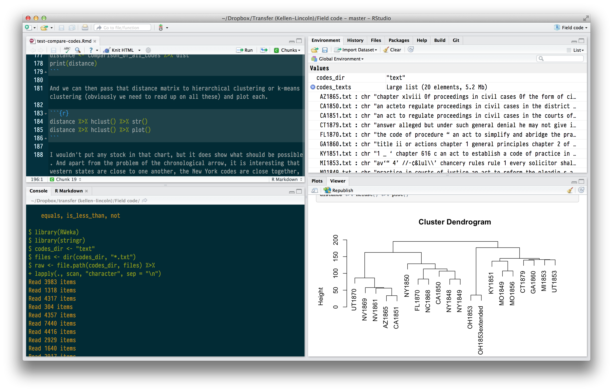

# Introduction

As I am writing this book my three-year-old daughter consistently confuses the words *how* and *why*. "How are you going to class?" she asks me, inquiring not my mode of transportation but my reason for leaving play time. "How are you doing" I ask her, and her reply is "Because I am happy." She understands the concepts of *how* and *why* but simply has the words for them reversed, and when I speak to her I sometimes get them backwards too.

This is a book about *how*, not about *why*. With the exception of the apologetic offered in ths introduction, it is entirely about the how of doing digital history in a particular programming language, rather than the why of doing digital history. Academics tend to favor theoretical musings over practical how tos. But I am convinced that digital history has more in common with carpentry than it does with philosopy.^[I am not alone in this: See David David on [data carpentry](http://mimno.infosci.cornell.edu/b/articles/carpentry/), and many posts by Stephen Ramsay, especially "[On Building](http://stephenramsay.us/text/2011/01/11/on-building/)." TODO] In other words, I think that digital history is a craft knowledge about how to build things. This is not to say that there is no theory behind the practice of doing digital history: there is a great deal. But that knowledge is latent in actual how to. *How* explains *why*.

MORE TO SAY


## Why this book?

This book sits at the intersection of two genres of books of interest to digital historians.

The other are 

Some books have already bridged these two genres. Most notably, Matthew Jocker's, *[Text Analysis with R for Students of Literature](http://www.matthewjockers.net/text-analysis-with-r-for-students-of-literature/)* (Springer, 2014)

Other books on R.

Other books on DH.

This book also aims to be an introduction to the technical literature on various digital humanities subjects. After providing you with the basic concepts and codes to tackle text mining or network anaylsis, the chapters will point you to additional works which will deepen your conceptual and practical knowledge of how to apply these methods in history.

This book is not just an introduction to R, though any good introduction to digital history needs to be grounded in specific tools, or to computer programming, though that is a practice which is applicable to most DH domains. If it is not too immodest to suggest, this book is intended as an introduction to the digital humanities themselves, operating not at the level of theory but closer to the metal (as programmers would say) of digital history practice.

I think that there are four main area in which computer programming and R are suitable for a historian's work. The first is quantitative history, meaning history that is interested in what numbers and calculations can tell us about the past. Though more than a little out of favor with the historical profession since the cultural and linguistic turns, I think that the time is ripe for a return to quantativate methods. But these quantitative methods will in most cases be the foundation for other methods rather than the edifice itself. Those other methods are spatial history, meaning the creation of maps and thinking about space in other ways; text mining, meaning any of a number of ways of programmatically reading large numbers of texts at a distance; and network analysis, meaning analyzing and visualizing the connections between people, events, and sources. These are the four main areas that this book will cover. 
(There is a fifth area of digital history: public history, especially public history which presents itself on the web. R is not at all suitable for developing websites or exhibits.) In addition, the book will offer a basic introduction to R, techniques for dealing with data, and a set of advanced techniques for applying programmatic techniques.

## Why Computer Programming?

One reason why it is better to use computer programming as a method instead of push-button or GUI tools is that it is always possible to find out why an algorithm is operating in a particular way. It is our job as scholars to get to the bottom of things. When it comes to digital analysis, that means being able to trace to scholarly justifications from the macro level of analysis to the micro decisions about how to implement algorithms. In his [essay introducing network analysis](http://journalofdigitalhumanities.org/1-1/demystifying-networks-by-scott-weingart/), for example, Scott Weingart points out that the GUI software [Gephi](http://gephi.org/) will apply algorithms suited for single mode networks to multimodal networks. (If you don't yet understand what that means, suffice it to say that it is a serious problem.) Weingart was able to find that problem through serious digging: most scholarly users of the tool would not have. When writing programs to do analysis, the scholar much make such a decision for him- or herself. This, coincidentally, is another good reason to prefer open-source tools where the documentation and especially the code itself is available to inspection and modification, even if in most cases one will not actually inspect the source of libraries used.

Another reason to use computer programming is that it makes the steps in any analysis apparent. Think for a moment about the last time that you had to help someone on the phone to perform some simple task on a computer. The conversation might have gone like this:

> To open your web browser, you need to move the mouse to the left side of the screen. Has the Dock appeared? The Dock will have a bunch of icons? You say it hasn't appeared yet? Trying moving the mouse to the middle of the left side of the screen. Okay, ready? You want to left click on Google Chrome. It is the icon that looks like ... I guess it looks like a cross between a rainbox colored circle and a pie chart. You say a menu appeared? You need to left click not right click. Yes, the mouse button on the left. Okay, a window should be opening. ... Now click in the address bar. ...

Now try to imagine telling someone how to perform a complicated scholarly analysis. Now imagine trying to remind yourself six months from now how to perform that same analysis. Any time that you have to use a mouse to perform analysis, it becomes almost impossible to record the steps that can guaranteed the same result.

With programming, however, you have to express all of the concepts that you are using in a language. For all the differences between computer langauges and human languages, they are much closer together than either kind of language is to moving a mouse.  Because when programming you write everything down in text, it becomes possible to precisely state each step along the way. Computer programmers have developed some very sophisticated tools to document these steps, which we will cover in the chapter on [reproducible research](reproducible.html). And because everything is written down, it is possible to subject each step to scholarly scrutiny. (And if you haven't come back to a scholarly project after six months or a year and felt like you were reading something written by someone else, just wait six months or a year.)

Computer languages really are languages, in the sense that they share a grammar. And computer langauges (at least, high-level languages like R) exist to communicate to humans more than to communicate with machines. To understand what I mean about grammar, take the example below, which contains code for reading a spreadsheet (called a CSV file) and saving it to a variable.

```{r dummy_read_data, eval=FALSE}
data <- read.csv("my-file.csv")
```

This line of code is a sentence. The implicit subject is "Computer." The verb is `read.csv()`, that is, open the spreadsheet. The direct object is `my-file.csv`, the spreadsheet in our directory. And the indirect object is the variable `data` in which we are storing the data. (The `<-` operator indicates assignment.) Putting this together we get the sentence: "Computer, read the spreadsheet and save it to the variable named data." Parsing this kind of sentence is not yet natural for you, but it will become so. And if there is one thing that humanists are good at, it is language. No wonder that humanists struggle with graphical tools and excel when it comes to programming languages!

Finally, it is in the nature of the work that historians do that each of our problems is unique. I take it that one of the central values of working as a historian is figuring out the particulars of the past. While digital humanists have done quite a lot of work in creating general tools to solve general problems, the generality and abstraction that tools require will always run against the historian's need to look for and understand the particulars. Programming gives us a level of concreteness and degree of control that lets us put various tools together in ways that respects the fundamental nature of the historian's craft.

## Why R?

The most compelling reason to use R is that it probably the only language with a set of libraries that permits you to do any kind of analysis of interest to a historian with just one language. (Python is probably a close second.) Probably all digital humanists who write code are polyglots, taking advantage of the best libraries and languages for any given job. Yet there is a major cognitive burden that comes from switching languages within a project or from project to project. If you are able to focus on one language, you can take your skills to a much higher level, and you can reuse code from one project to another. R can be the one language that can do almost everything you would want to do as a historian.

The range of libraries that R has available is staggering. [CRAN](http://cran.rstudio.com/), the [Comprehensive R Archive Network](http://cran.us.r-project.org/) which distributes R libraries (called packages) currently has nearly six thousand packages. What matters more is that these packages provide a powerful set of tools for the techniques that matter most to historians. There are, for example, a powerful suite of packages for mapping and spatial analysis, other packages for text mining and document similarity, and yet more packages to create network graphs and analysis. In particular the statistician and computer programmer [Hadley Wickham](http://had.co.nz/) has created a suite of packages that provide a useful grammar for solving many kinds of data analysis and manipulation problems.

Another compelling reason to use R is that it is a language designed for data analysis. Most programming languages are general purpose programming languages for which libraries for data analysis, mapping, and visualization have been added on. R, however, was designed from the beginning for statistical computing. A language called S (for *statistics*) was designed by the statistician John Chambers and his colleages at Bell Laboratories in 1975--76. The language was gradually improved until in 1993 an open-source version of the language called R was released. Because R was designed for statistical computing, many handy features are deeply embedded in the language itself. One concept in R is the data frame, which (for now) you can think of as a spreadsheet containing data. This is an enormously useful way of structuring data for analysis. Python recently gained the concept of a data frame, but only in through the add-on package Pandas which emulates much of R's fuctionality. To give another example, R has many built-in functions that are useful for data analysis. Suppose you wanted to add a list of numbers (in most programming languages this is called an array; in R it is called a vector): `1, 2, 3, 4, 5`.

In JavaScript, you would have to create a counter variable and use a for loop to add the numbers together:

```
var data = [1, 2, 3, 4, 5];
var sum = 0;
for(var i = 0; i < data.length; i++) {
  sum += data[i];
}
console.log(sum);
// 15
```

If you were a more sophisticated JavaScript programmer, you could write get the same result more elegantly: 

```
function add(a, b) {
  return a + b;
}

var sum = [1, 2, 3, 4, 5].reduce(add, 0)
console.log(sum)
// 15
```

Unless you already know JavaScript or some other programming langauge, you probably can't read those examples. In R, adding a list of numbers looks like this:

```{r sum_in_r}
sum(c(1, 2, 3, 4, 5))
```

R offers a tremendous expressive power: we managed to write a kind of sentence ("sum this list of numbers") rather than resort to several lines of code. R is powerful in that it builds in many of these kinds of functions (for example, linear regression) which in other languages would require much more effort to use.

R is able to acheive such expressiveness because it is what is called a high-level language. It is helpful to think of computer languages as residing on a spectrum. Some languages at the bottom end of the spectrum are very much like writing instructions to a machine. These kinds of languages, like C or Java, are enormously powerful and often blazingly fast, but they are also much more difficult to learn and take many lines of code to accomplish anything substantive. Languages at the high end of the spectrum (like R, Ruby, of Python) offer a much higher level of abstraction. This is good for a historian because it permits us to come closer to writing code that expresses our analysis rather than writing code that expresses what the machines needs to know.

R is also useful to a historian because of the set of tools that are available to write R code. R has particularly good environments for writing code interactively, that is, for writing a block of code, executing it, and then iterating it. This is important because R is as much an environment for doing data analysis as it is a programming language. (It *is* a programming language, though, contrary to what its ill-informed detractors sometimes say.) In other words, when doing historical research in R, one is usually building and tweaking an analysis by repeatedly running code, instead of writing it all at once and then running it once. The [R Studio IDE](http://www.rstudio.com/products/RStudio/) (Integrated Development Environment) lets you see the code you are writing, a place to execute it (called the console), the value of your variables, and any plots that you have made, along with debugging tools and easy access to the R documentation, in a single window. R also has excellent tools for mixing prose and code and graphics. It is possible using a [RMarkdown](http://rmarkdown.rstudio.com/) (especially in the RStudio IDE but also elsewhere) to create a document which has text with code and the values and output embedded in it. (This technique is sometimes called [literate programming](http://en.wikipedia.org/wiki/Literate_programming), a term coined by the computer scientist Donald Knuth.) In fact, this book is being writing with RMarkdown, and you can see the how the [source code](https://github.com/lmullen/dh-methods-in-r) mixes code and words.



Finally, R is a good choice because there many other historians and digital humanists are using it. When selecting any tool, it is always wise to use the tool or language that your colleagues are using. In part this is so that you can learn from them at the early stages of your work. But in the later stages of your work, it is just as important that your work be legible to them and able to be critiqued by them.

To be sure, there are some things that R can not do as well as other languages. R is not especially good at interactive graphics, though R is getting better and better packages for for interactive, exploratory data graphics, most notably the [ggvis](http://cran.r-project.org/web/packages/ggvis/index.html) package. Nor is R especially easy to use if you want to create bespoke visualizations instead of using the common kinds of visualizations. It is entirely possible to put R graphics on the web, but it is not (or not yet, anyway) quite so easy to make graphics in R that are of the web and not just on the web. If those are the kinds of graphics that you want to make, then you should look into the [D3.js library](http://d3js.org/) for JavaScript written by Mike Bostock. Bostock has provided fantastic documentation at the D3 website and Scott Murray's *[Interactive Data Visualization for the Web](http://chimera.labs.oreilly.com/books/1230000000345)* (O'Reilly, 2013) is an excellent introduction. Elijah Meeks, a Digital Humanities Specialist at Stanford University, has written an advanced book called *[D3.js in Action](http://manning.com/meeks/)* (Manning, forthcoming) which is especially good for historians and humanists. 

Most of the time, when a historian needs to *explore* data instead of *present* it, R is a perfectly adequate tool. And if you do go on to learn D3.js, you will appreciate the ability to create mockup graphics and manipulate data in R.

## Why *in* Anything?

One might justly ask why there should be a book not just about digital history methods *in R*, but why there should be one about digital history methods *in Anything*. In other words, why is it necessary that a book about methods should also be about R or Python, or GIS or Gephi, or any of the innumerable languages or tools that digital historians use, instead of just being about what is common to those methods proper apart from any particular tool? If this kind of historical work is indeed scholarship, why should it be beholden to any particular tool, especially tools which change as quickly and inconstantly as programming languages. This is a fair question, but one that misunderstands the nature of digital history work, and of history work in general.

The nature of digital history work is that there can be no theory apart from practice, and not just practice in general but specific practices with specific technologies on specific machines. Granting theoretical thinking about digital history its due weight, in general I think that one learns more from a day playing around with data in R than from a day theorizing the digital humanities, just as one learns more about the past from a day in the archives than from a day of theoretical musings. This is because historian's contributions to knowledge are not primarily abstractions but interpretations. In history we are interested in particulars. And for digital history, that means that we must be interested in the particulars of using a given technology to solve a given problem. To be sure, you will learn general principles that will serve you well for other projects not in R. But I don't think that you can learn the general principles (at least well) apart from specific applications.
