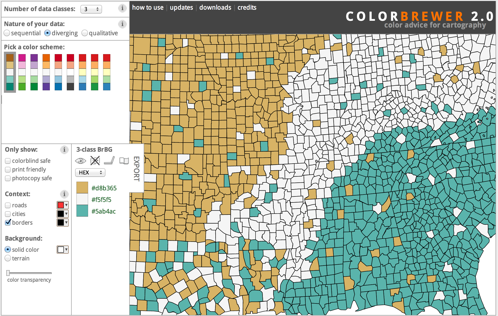

```{r,echo=FALSE}
source("general-options.r")
```

# Mapping

Mapping is difficult because of the difficulty in representing geospatial data. In particular, the dominant format for spatial data is the [shapefile](http://en.wikipedia.org/wiki/Shapefile), which is a proprietary but mostly open format with some severe limitations. Geospatial data can be very large: in the hundreds of megabytes. Often it is unnecessarily large for the resolution of the map that you want to make, and must be simplified in order to be manageable. Finally, geospatial information is projected, meaning that it can represent a point's position on the earth by a latitude or longitude but also by any other number of [coordinate reference systems](http://en.wikipedia.org/wiki/Spatial_reference_system). These systems have to be translated between one another. In general, it is easiest to prepare geospatial data outside of R and then to load and import it. This chapter focuses primarily on what you can do with R, but the companion chapter on [working with shapefiles](shapefiles.html) demonstrates how to take a shapefile and then convert and simplify it into a useable format.

Another problem with geospatial information is that it is usually intended for contemporary use, which means that the information about boundaries and even about natural features like rivers and coastlines may be anachronistic. You will have to be cautious about finding geospatial information that fits your time and place.

There are some good resources for getting geospatial data. [NHGIS](http://nhgis.org) contains aggregated census information for the United States keyed by special codes to shapefiles that they provide. We will use NHGIS data about manufacturing in this chapter.[Natural Earth](http://www.naturalearthdata.com/) provides all kinds of geographic information, such as rivers, coastlines, and mountains.

Nevertheless, mapping is the digital history technique from which it is easiest to make historical arguments. Not coincidentally, it is also the digital history technique which is easiest to explain to non-digital historians. Historians have been working with maps since at least the beginnings of the historical profession: digital mapping gives you the capability to map data and places yourself.

## Installation and setup

Most R packages that work with geospatial data are wrappers around libraries written in lower-level languages. In order to use these packages, you will have to install those libraries which are external to R. The two main libraries are [GDAL/OGR](http://www.gdal.org/), which you will likely have to install anyway in order to get the command line tools to prepare your geospatial data, and [GEOS](http://trac.osgeo.org/geos/).^[Make sure you get version 1.11.0 or later of GDAL/OGR, which added support for [topojson](https://github.com/mbostock/topojson).] (In most cases, the R wrapper for GEOS can install the external library itself.)

You can install these packages by following the instructions on their respective websites. If you are on Mac and use [Homebrew](http://brew.sh/), you can install them with the following commands.

```
brew update
brew install gdal
brew install geos
```

If you are on Ubuntu, you can install them with the following commands. These libraries will be found in almost any Linux package manager.

```
apt-get update
apt-get install gdal-bin libgdal-dev libproj-dev
apt-get install libgeos-dev
```

Once you have those libraries installed, you can install the necessary R packages, which include the following:

- [sp](http://cran.r-project.org/web/packages/sp/index.html) provides the classes which describe geospatial data, and it will let you use base R functions like `plot()` to make maps. Virtually every geospatial package for R depends on this package.
- [rgdal](http://cran.r-project.org/web/packages/rgdal/index.html) provides functions to read and write spatial datasets.
- [rgeos](http://cran.r-project.org/web/packages/rgeos/index.html) provides functions for manipulating spatial information.
- [maptools](http://cran.r-project.org/web/packages/maptools/index.html) provides functions for manipulating spatial information.
- [ggmap](http://cran.r-project.org/web/packages/ggmap/ggmap.pdf) lets you map spatial information on top of Google Maps, but its chief usefulness is for its `geocode()` function which uses Google's API.
- [ggplot2](http://cran.r-project.org/web/packages/ggplot2/index.html) will let us plot spatial information using the same grammer we used for [plotting](plotting.html).
- [classInt](http://cran.rstudio.org/web/packages/classInt/) lets us assign groupings to variables to be plotted.
- [RColorBrewer](http://cran.rstudio.org/web/packages/RColorBrewer/) offers color palettes which are good for map making.

You can install all of these with the following command.

```{r eval=FALSE}
install.packages(c("sp", "rgdal", "rgeos", "maptools",
                   "ggmap", "ggplot2", "RColorBrewer", "classInt"),
                 dependencies = TRUE)
```

On Mac, R will try to intall binary versions of rgdal and rgeos which do not need the external dependencies. In general, `install.packages()` tries to get a binary package, meaning a package which contains everything necessary for your operating system. If R can do that for, say, rgdal, then you don't need to install the external library. But this doesn't always work, in which case R lets you build the package from source, and you do need the external libraries. If this method of installation fails, and R complains that a binary package is not available, then try the following installation commands.

```{r eval=FALSE}
install.packages("rgdal", type = "source")
install.packages("rgeos", type = "source")
```


## Loading and plotting a shapefile

The first step in making a map is to load our geospatial data. I have prepared a shapefile from the NHGIS with the state boundaries of the United States in 1850 by reprojecting it and simplifying it. We can load this shapefile using the `readOGR()` function in the [rgdal](http://cran.rstudio.org/web/packages/rgdal/) package. The `readOGR()` package takes two main arguments: the first is the path to the directory with the shapefile, and the second is the name of the shapefile without its extension. 

```{r}
library(rgdal)
map_sp <- readOGR("data/nhgis-shp/", "state_1850")
```

We now have an object which we have saved as `map_sp`. We can investigate the class and structure of this object.

```{r}
class(map_sp)
```

The object is a `"sp"`, which means it is an object of the type provided by the [sp](http://cran.rstudio.org/web/packages/sp/) package. Almost all spatial objects will have this type. The object is also a `"SpatialPolygonsDataFrame"`. There are three basic types of spatial data: points, lines, and polygons. This file contains polygons.

```{r}
str(map_sp, max.level = 2)
```

The structure of the object is even more revealing. The object has several "slots," which are the places where R stores information for objects. TODO: Explain R object systems. We can see that the object contains 37 polygons: one for each of the states and territories on the map. It also contains information such as the `bbox`, which is the maximum extent of the map in terms of latitude and longitude, and the `proj4string`, which contains the coordinate reference system. We can look at either of those slots with `@`.

```{r}
map_sp@bbox
map_sp@proj4string
```

The latitude and longitude of the bounding box is what we would expect for the United States. The `proj4string` tells us that this object is not projected; it happens to use the [EPSG 4326](http://spatialreference.org/ref/epsg/4326/) coordinate reference system which uses latitude and longitude.^[The website <http://spatialreference.org/> is helpful for understanding various coordinate reference systems.] Notice that in both cases the longitude comes first because it is mapped to the x axis, and latitude comes second because it is mapped to the y axis.

The other interesting slot is `data`, which contains a data frame. We can investigate this data frame:

```{r}
head(map_sp@data)
```

This shows us that the `r nrow(map_sp@data)` rows of the data frame correspond to each of the states and territories. There is some important information in this data frame. First, we have several columns that will permit us to join this data frame to other data sets. `NHGISST`, `ICPSRST`, `GISJOIN`, and `GISJOIN2` are all special ID fields to be used for this purpose; in a pinch, we could use the `STATENAM` column too. We also are given the `SHAPE_AREA`, which will let us normalize the data by the area of the polygon.

The data in this data frame does not come standard with every shapefile. In this case it has been added by the NHGIS. Other shapefiles will come with data already included: the [Natural Earth](http://www.naturalearthdata.com/) shapefiles have many columns which are useful for plotting. Some shapefiles produced by historical organizations will contain the dates that boundaries are valid for. The Newberry Library's *[Atlas of Historical County Boundaries](http://publications.newberry.org/ahcbp/)* is a particular good example of using shapefiles for this purpose. Many shapefiles will come with no information whatsoever.

The [sp](http://cran.rstudio.org/web/packages/sp/) provides a [method](http://stat.ethz.ch/R-manual/R-devel/library/methods/html/Methods.html) so that it can be plotted using the generic R function `plot()`. This is the fastest and easiest way to make sure that your shapefile has sometime useful.

```{r plot-sample-shapefile}
plot(map_sp)
```

The [sp](http://cran.rstudio.org/web/packages/sp/) and [rgdal](http://cran.rstudio.org/web/packages/rgdal/) packages contain many useful functions. Not least is the ability to reproject a shapefile. A projection transforms the three dimensional space of a (nearly) spherical globe into two dimensional space. There are [many map projections](http://www.jasondavies.com/maps/transition/) which are useful for different purposes. We can see what we mean by using a [shapefile of the earth's land](http://www.naturalearthdata.com/downloads/50m-physical-vectors/) from [Natural Earth](http://www.naturalearthdata.com/) and plotting i.

```{r natural-earth-projection}
earth <- readOGR("data/ne_50m_land/", "ne_50m_land") 
plot(earth, col = "gray")
title("The world according to EPSG 4326")
```

Using the `spTransform()` function, we can set a new projection. We will use the [Winkel tripel projection](http://en.wikipedia.org/wiki/Winkel_tripel_projection) since it is obviously different from (and superior to) the standard projection. (You can find the [PROJ.4](http://en.wikipedia.org/wiki/PROJ.4) definitions for many coordinate reference systems online.) First we transform the shapefile then plot it.

```{r natural-earth-reprojected}
winkel <- spTransform(earth, CRS("+proj=wintri"))
plot(winkel, col = "gray")
title("The world according to Oswald Winkel")
```

It is well worth learning the base R graphics in order to interact with plots in these ways. But just as we used [ggplot2](http://cran.rstudio.org/web/packages/ggplot2/) in the [plotting chapter](plotting.html), so we will use it here because it provides a grammar of graphics, and thus a way of thinking through our problems. Before we explore how to make maps in [ggplot2](http://cran.rstudio.org/web/packages/ggplot2/), we will first have to get some data to plot on top of our shapefiles.

## Geocoding

There are essentially three kind of spatial information that can be plotted: points, lines, and polygons. We have already seen what polygons look like. Often if it is sufficient to draw a point representing a city or an event. Given a place name, it is possible to look up that latitude and longitude for that place using Google's API.^[One must be cautious of anachronism, of course, since Google's API only has current place names. In general, though, cities do not move.]

The [ggmap](http://cran.rstudio.org/web/packages/ggmap/) package provides a `geocode()` function which calls Google's API and returns a latitude and longitude.

```{r}
library(ggmap)
geocode("San Francisco, CA")
```

The function's default arguments return only latitude and longitude, but it is capable of returning quite a lot of information, such as the precision of the guess as to the location.

```{r}
geocode("San Francisco, CA", output = "more")
```

Let's take a small data frame of cities that we might want to plot on a map.

```{r}
cities <- data.frame(name = c("Saint Louis, MO",
                    "San Francisco, CA",
                    "Boston, MA",
                    "Charleston, SC",
                    "Houston, TX"),
           stringsAsFactors = FALSE)

cities
```

We can then add two columns to our data frame using geocode. `geocode()` function returns a data frame, which makes it awkward to use with dplyr.  

```{r geocode, message=FALSE}
cities_geocoded <- geocode(cities$name)

cities_geocoded
```

We will have to bind this new data frame to our cities data frame.

```{r}
cities <- cbind(cities, cities_geocoded)
```


We we have a data frame that we can plot using [ggplot2](http://cran.rstudio.org/web/packages/ggplot2/), remembering to map the longitude to `x` and the latitude to `y`. We will also use the [ggplot2](http://cran.rstudio.org/web/packages/ggplot2/) function `coord_map()` which will set the coordinate system for our plot to something that makes sense for a map. (The default is the [Mercator projection](http://en.wikipedia.org/wiki/Mercator_projection); we will change this later.) The `geom_text()` function will print the name of the city.

```{r first-ggplot2-map}
library(ggplot2)
ggplot(cities, aes(x = lon, y = lat)) +
  geom_point() +
  geom_text(aes(label = name), vjust = -1) +
  coord_map()
```

This looks about right, though the labels could be better placed. But this is hardly useful without some kind of boundaries beneath it.

## Plotting polygons in ggplot2

To plot our earlier `map_sp` of U.S. state boundaries in 1850, it is necessary to convert the shapefile object to a data frame. The [ggplot2](http://cran.rstudio.org/web/packages/ggplot2/) package contains a function `fortify()`, which will perform the conversion. We will need to pass it a `region =` argument with the name of the field that we might want to perform a merge with. With NHGIS data, the `GISJOIN` field is the best to use.

We can also fortify using the `tidy()` function from the [broom](http://cran.rstudio.org/web/packages/broom/) package. TODO

```{r}
map_df <- fortify(map_sp, region = "GISJOIN")

head(map_df)
```

Now that we have a data frame, we can plot it. Because we are going to use the `cities` data frame, we are going to specify different data frames for ggplot to use. Instead of specifying the `data =` argument in the main `ggplot()` function, we will specify it in the layer arguments.

```{r map-1850}
map_1850 <- ggplot() + 
  geom_map(data = map_df,
           map = map_df,
           aes(x = long, y = lat, group = group, map_id = id),
           fill = "white",
           color = "black",
           size = 0.2) +
  coord_map() +
  theme_minimal()

map_1850
```

Now we have a map of the states in 1850. We can modify our code that plotted the cities above.

```{r map-1850-with-cities}
map_1850 +
  geom_point(data = cities, aes(x = lon, y = lat),
             color = "red", size = 3) +
  geom_text(data = cities, aes(x = lon, y = lat, label = name),
            vjust = -1)
```

We can use a more sophisticated dataset to plot points on the map. The [historydata](https://github.com/lmullen/historydata) package contains a geocoded set of Paulist missions. We might normally display just the missions from 1850, but for learning purposes we will display all the missions at once.

```{r}
library(dplyr)
library(historydata)
data(paulist_missions)
glimpse(paulist_missions)
```

We can add these as points to our 1850 map. Instead of sizing the points all the same, we will size them by number of confessions at the mission, but we will use hollow circles (`shape = 1`) to try to deal with the problem of overplotting. 

```{r map-of-paulist-missions}
map_1850 +
  geom_point(data = paulist_missions,
             aes(x = long, y = lat, size = confessions),
             color = "red", shape = 1) +
  theme(legend.position = "bottom") +
  scale_size(range = c(2, 8)) + 
  ggtitle("Paulist missions as points")
```

When plotting many points, sometimes it makes more sense to plot the density of the points instead of the points themselves. We can do this in [ggplot2](http://cran.rstudio.org/web/packages/ggplot2/) with either the `geom_hex()` or `geom_density2d()`.

```{r paulists-with-density2d}
map_1850 +
  geom_density2d(data = paulist_missions,
             aes(x = long, y = lat)) +
  theme(legend.position = "bottom") +
  ggtitle("Paulist missions with density plot")
```

## Choropleths

A choropleth map shades the region with a color keyed to some meaning. For example, we might color the region based on population, with regions with little population being represented by the color white, and regions with the most population being represented by the color green. We already know how to shade a region in [ggplot2](http://cran.rstudio.org/web/packages/ggplot2/): we simply map the `fill =` argument to some variable in our dataset. 

Before we can do this, however, we have to join our spatial data to the data we wish to map. (Joining is covered in more detail in the chapter on [data manipulation](data.html).) 

We'll begin by loading in a shapefile of the US counties in 1850 and turning it into a data frame which we can use with ggplot2.

```{r}
counties_1850_sp <- readOGR("data/nhgis-shp/", "US_county_1850")
counties_1850_df <- fortify(counties_1850_sp, region = "GISJOIN")
glimpse(counties_1850_df)
```

Notice that this data frame, `counties_1850_df`, has an ID column which we can use for merging our data. Let's load in NHGIS data about the "Average Value of Farmland and Buildings" in dollars by county in 1850.

```{r}
farms_1850 <- read.csv("data/nhgis-farmland-value/nhgis0032_ds11_1850_county.csv",
                       stringsAsFactors = FALSE)
glimpse(farms_1850)
```

Notice that this data has the same kind of field, only called `GISJOIN`. We can perform a join between the two data frames using the `id` and `GISJOIN` columns from the respective variables.

```{r}
farms_merged <- counties_1850_df %>%
  left_join(farms_1850, by = c("id" = "GISJOIN"))
glimpse(farms_merged)
```

Now we have all the information in one place. We can make a map of the counties in 1850, but this time we will set `fill = AE7001` to make the choropleth.

```{r first-choropleth-of-farms}
ggplot(data = farms_merged,
       aes(x = long, y = lat, group = group, fill = AE7001, map_id = id)) +
  geom_map(map = farms_merged) + 
  ggtitle("Average value of farms and buildings in dollars/acre in 1850") + 
  coord_map() +
  theme_minimal() +
  theme(legend.position = "bottom") 
```

This is not a very good map. It still has two related problems. First, the color scheme is difficult to read. We need to pick a better color palette. Second, the map plots the color on a continuous scale. That is, there is an infinite possible number of values between 0 and the maximum. But the values tend to clump on the low end of the scale, and there are a few very high values. We can use the `summary()` function and then a histogram to see the distribution of the `AE7001` variable in our original dataset.

```{r}
summary(farms_1850$AE7001)
```

```{r distribution-of-average-values-of-farmland}
ggplot(data = farms_1850, aes(x = AE7001)) + geom_histogram(binwidth = 10) +
  ggtitle("Distribution of average values of farmland in 1850")
```

We can see from both the summary statistics and the histogram that the vast majority of counites have farmland and buildings valued on average at $12 per acre or less. But on county has farmland averaging $`r max(farms_1850$AE7001)` per acre. (We might suspect that this value is an error, but looking at the data shows that outlier is New York City, which makes sense.)  That one value reduces the contrast in our data, so to speak, so that we cannot see distinctions among the rest of the counties.

We will do much better if we break up the values into bins. That is, we could say that a county with property values of $1 or $2 per acre will receive the same color, and so on. The best way to do this is with the [classInt](http://cran.rstudio.org/web/packages/classInt/) package. (Install it with `install.packages("classInt")`.) This package provides several ways of assigning groupings to a variable. For example we can try the `pretty` method in the package. We have to tell the `classIntervals()` function the variable for which we want to compute the breaks, the number of groupings that we want (keep this to 9 or fewer), and the method of computing the breaks.

```{r}
library(classInt)
classIntervals(farms_1850$AE7001, 9, "pretty")
```

These breaks are indeed pretty to read, but not very helpful. There are 1515 counties between $0 and $200 average value; but only 1 between $200 and $400, and then 0 in all the rest of the intervals until we get to New York City. We clearly need a better algorithm. The [Jenks natural breaks algorithm](http://en.wikipedia.org/wiki/Jenks_natural_breaks_optimization) tries to make the members of each group as alike as possible, while making each group as a whole as distinc from other groups as possible.

```{r}
intervals <- classIntervals(farms_1850$AE7001, 9, "jenks")
intervals$brks
```

Those intervals are far more useful. (Notice that the `intervals` object is a list, and we can access the `brks` themselves with the `$`.) We see some real resolution or contrast in the data. We should create a new column in our original farms data frame with those values and remerge the data back to the county shapefile. The `cut()` function will use our intervals to "cut" up our existing data points into different groups.

```{r}
head(cut(farms_1850$AE7001, breaks = intervals$brks))
```


```{r}
farms_1850 <- farms_1850 %>%
  mutate(value_classified = cut(AE7001, intervals$brks))

farms_merged <- counties_1850_df %>%
  left_join(farms_1850, by = c("id" = "GISJOIN"))

glimpse(farms_merged)
```

Now we can redo our plot by this new variable.

```{r map-with-intervals}
ggplot(data = farms_merged,
       aes(x = long, y = lat, group = group, map_id = id,
           fill = value_classified)) +
  geom_map(map = farms_merged) + 
  ggtitle("Average alue of farms and buildings in dollars/acre in 1850") + 
  coord_map() +
  theme_minimal() +
  theme(legend.position = "bottom") 
```

This map is far better: instead of an undifferentiated mass of color, we can see see distinctions between the value of property across the country. It is important to note that these distinctions are not simply random, as if we had chosen bad groupings for our variables, but seem at first glance to create contiguous regions and to have variation which could begin to be an argument.

The biggest problem is that the colors do not help us understand the data. The palette offers colors which are far apart from one another (that is, equally distant from one another on a color wheel). This is what one might call, using Cynthia Brewer's terminology, a qualitative scale. If we were mapping political parties, say, in the 1852 election it would be desireable to distinguish between the Democrats, the Whigs, and the Free Soil party. But our scale is what Brewer calls a sequential scale. That is, the values increase sequentially. This map would be better represented by a shade of colors that grew darker the more expensive land was, so that we could see a progression in the colors. Brewer also offers a diverging scale, which has a neutral color (like white) in the middle and two opposite colors at the beginning and end of the scale. The [Color Brewer 2.0](http://colorbrewer2.org/) website by Cynthia Brewer and Mark Harrower provides a very helpful set of color palettes and maps to pick the right color palettes for maps.



The same palettes can be accessed in R and used with [ggplot2](http://cran.rstudio.org/web/packages/ggplot2/) using the [RColorBrewer](http://cran.rstudio.org/web/packages/RColorBrewer/) package. (Install this package with `install.packages("RColorBrewer")`.) The package provides a `display.brewer.all()` function which lets us see all the available color palettes.

```{r color-brewer-palettes}
library(RColorBrewer)
display.brewer.all()
```

Now we can change the fill scale of our map to use the RColorBrewer palette of our choice, in this case `YlGnBu`.

```{r map-with-color-brewer-intervals}
ggplot(data = farms_merged,
       aes(x = long, y = lat, group = group, map_id = id,
           fill = value_classified)) +
  geom_map(map = farms_merged, color = "gray", size = 0.2) + 
  ggtitle("Average value of farms and buildings in dollars/acre in 1850") + 
  coord_map() +
  theme_minimal() +
  theme(legend.position = "bottom") +
  scale_fill_brewer(palette = "YlGnBu")
```

Finally, we can improve this map by setting more sensible limits on the longitude limits, since we don't have data for the western United States.

```{r map-with-color-brewer-intervals-cropped}
ggplot(data = farms_merged,
       aes(x = long, y = lat, group = group, map_id = id,
           fill = value_classified)) +
  geom_map(map = farms_merged, color = "gray", size = 0.2) + 
  ggtitle("Average value of farms and buildings in dollars/acre in 1850") + 
  coord_map() +
  theme_minimal() +
  scale_fill_brewer(palette = "YlGnBu") +
  xlim(-98, -65)
```

Note that we cannot simply take this map as read, but must bring our historical knowledge to bear on it. This map seems to show that the northern states are wealthier than the southern in terms of real property. Or, we should say, the property was more expensive on average; we cannot say what the total wealth in each county was from this data alone. But what the map does not show is people held as real property, that is, slavery. Our map would have a considerably different meaning if we could add in the value of slaves held on southern farms.^[Ed Baptist, The Half Has Never Been Told, TODO.]

## Dot maps

## Specifying projections in ggplot

## Named Entity Extraction

How to get place (and other kinds of names) out of a document.

## Next Steps

Further Reading

- Bivand, Roger S., Edzer Pebesma, and Virgilio Gómez-Rubio. *[Applied Spatial Data Analysis with R](http://link.springer.com/book/10.1007/978-1-4614-7618-4)*. Springer, 2013.
- Bodenhamer, David J., John Corrigan, and Trevor M. Harris. *The Spatial Humanities: GIS and the Future of Humanities Scholarship*. Bloomington: Indiana University Press, 2010.
- Gregory, Ian N. and Alistair Geddes. *Toward Spatial Humanities: Historical GIS and Spatial History*. Bloomington: Indiana University Press, 2014.
