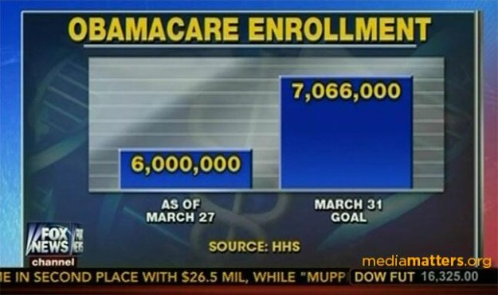

# Plotting

One of the most powerful things that you can do with R is also one of the conceptually most simple: make plots. We'll begin with a distinction between plotting and other kinds of visualization. A map is of course a visualization, as is a network graph. But there are other kind of plots on a cartesian plane (that is, an x-axis and y-axis) which are probably what come to mind when you think of plots. It is these kinds of plots that we will address first: scatter plots, line charts, bar charts, histograms, and the like.


Despite their deceptive simplicity, such plots are powerful for two reasons. First, because they can turn numbers or other values into visualizations, they can uncover information which we cannot otherwise readily understand. Take for instance this simple list of ages from a membership list. What is the pattern? 

```{r simple-histogram}
numbers <- c(1,5,3,2,4,5,3,2,2,4,5,2)
hist(numbers)
```

It is very difficult for us to discern any pattern in the list of numbers. A simple histogram puts the numbers into bins, counts the number of occurences in each bin, and draws a bar chart to report this. This visualization makes this apparent to the mind. Moreover the property of the length of the bars makes it possible to 

The other primary characteristic of these charts is that they express relationships between variables. Let's take a simple chart.

TODO: Plot of American Jewish population

This chart expresses a relationship between two variables: time and an estimate of the population of American Jews. The horizontal axis is the x-axis and the vertical axis is the y-axis. Part of the convention of graphics which we have become acculturated to expect is that the x-axis represents an independent variable, and y-axis represents an dependent variable. In other words, whatever is plotted on the y-axis is thought of a depending on the x-axis, but not the other way round. The passage of time may change the population of American Jews, but the population of American Jews does not change the passage of time.

We can classify charts by the number of variables that they represent and by how they go about doing the representation:

- One variable: a histogram such as the example above.
- Two variables: scatterplots, line charts, bar charts, and the like usually express two variables.
- Three or more variables: But it is possible to map a different kind of drawing besides the x and y position, such as the color and size of a line or circle in order to represent more than one variable.
- Three or more variables: It is also possible to facet a plot, meaning to show many small charts right next to each other to show how one variable affects another.
- Three or more variables: It is also possible to plot multiple variables on the same plot using the x and y position.^[Using different scales on the axes is never recommended, however.]

Whenever using plots to express relationships between variables, one is using an enormously powerful tool. One must be careful to use it to ask the right questions, and to be suspicious of exactly what the causal or correlative mechanism might be between two different variables. Historians have a special affinity for plots which show the relationship between time and some other variable. These are called time series. But it is possible to express the relationship between any two or more variables visuallly. It is easy to overwhelm the viewer. One must also keep in mind that even if a visualiation is worth a thousand words, the thousand words are still necessary to explain what the visualization means and to draw an interpretation out of it.

TODO: Example

The principle behind all this is that we are making a map between the variables in our data sets and the modes of representing them: from time to the position on the x-axis, from the value to the position on the y-axis, from the type to the color, and from the other value to the size. This map constitutes a kind of a grammar of graphics.

## The Grammar of Graphics

Grammar of graphics can refer to two related ideas. In the the generic sense, we can use the term to refer to the conventions for what visual representations mean. For basic plots like scatterplots these are well established for most people, though visual literacy is presumably higher in disciples that deal with data like the sciences than it is in history. There are also more complex visualizations, like network charts which take much more explaining.

It is important to become familiar with these conventions. One common guide is Edward Tufte, who has a number of useful is also sometimes idiosyncratic recommendations in his books. An even better way to become familiar with the grammar is to expose yourself to as many kinds of visualizations of different subject matter as possible. There is unfortunately a discourse around visualizations that makes fun of bad visualizations. Many visualizations are indeed bad, and you should steer clear of them. But don't let this conversation discourage you from attempting many bad visualizations in the pursuit of making a few good ones.



*This bar chart from Fox News makes the error of not starting the two bars at 0. The comparison between them is thus entirely meaningless.*

The other meaning of Grammar of Graphics is as a formal term described by Leland Wilkinson in a book by that name, and made available in R for plots through Hadley Wickham's ggplot2 package.


## ggplot2

```{r}
library(magrittr)
library(ggplot2)
mtcars %>% ggplot(aes(x = wt, y = mpg)) + geom_point() + geom_smooth() + ggtitle("Weight vs. MPG in MTCARS data set")
```

## Base R

## Saving plots

PNG vs SVG vs PDF vs etc.

## Further Reading

- David J. Staley, *Computers, Visualization, and History: How New Technology Will Transform Our Understanding of the Past* (M.E. Sharpe, 2003).
- Kieran Healy and James Moody, "Data Visualization in Sociology" *Annual
Review of Sociology* 40 (2014): 105--128.
- Tufte's books.
