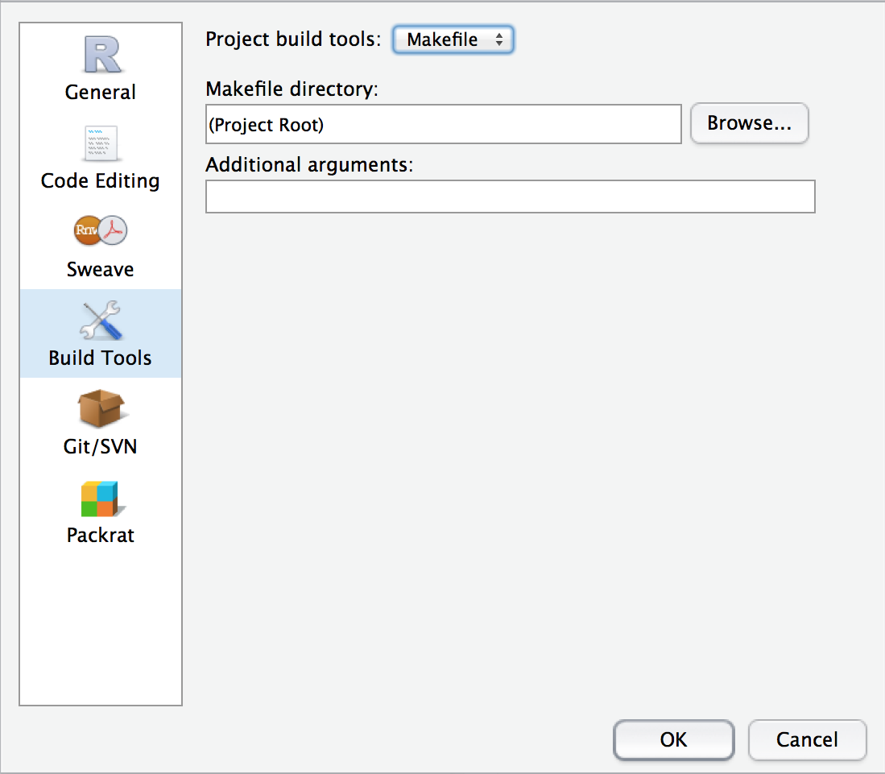

```{r,echo=FALSE}
source("general-options.r")
```

# Reproducible Research

Reproducible research is a concept borrowed from the sciences, which are currently working on ways to make research reproducible. This borrowing might seem to imply that reproducible research implies a kind of scientific method, but it does not. We must distinguish between the terms *replicable*, *reproducible*, and *verifiable*.^[Some people reverse the terms *reproducible* and *replicable* as I have defined them here.] Replication is central to the scientific method. It is the idea that an experiment should be able to be repeated in different laboratories. This ability to repeat experiments and get the same results constitute verification in the sciences.

Historians hold to different standards when it comes to replicability and verification. Historians do expect a limited degree of replicability from other scholars. If you look up a source cited for a quotation by a scholar, you expect that the words of the quotation should match verbatim, as well as that the sense of the quotation should not have been distorted from its context. This constitutes a kind of verification, and historians do in practice look up one another's footnotes. But no one expects that a work of history should be replicable. That is (except in cases of plagiarism) no one looks up all the footnotes and re-reads all of the sources for a work of history. More importantly, historians do not expect that even if they read exactly the same sources in exactly the same order as some other historian, that they would come to the same conclusion as she did. There is an irreducible component of interpretation in every historical study. This is not to suggest that works of history are unverifiable. Historians do hold one another to standards of evidence and argumentation, just not to a standard of replication. History---even computational history---remains a humanistic method.

Reproducibility is more a practical than a theoretical concern, and it is a technique which the computational humanities would do well to borrow from the sciences. Reproducible research means that a scholar can take the inputs (let's call these "data," defining *data* as any source that is amenable to computation) and at any time rerun her code to produce the same outputs. For example, a scholar might have a CSV file of data about the economic production of farms. Using R, she writes code which turns that data into a chart of changing farm production, as well as a table of summary statistics. Both of these are embedded in an article that she is writing. The data are the inputs. The code represents the analysis. The chart and the table are the outputs of the analysis: one can also think of the article itself as the output.^[You should recognize here an important tenet of the Unix philosophy: programs should be filters. In other words, the code does not actually change the data but merely passes it through a filter to produce the outputs. This is also an important idea in [functional programming](http://www.smashingmagazine.com/2014/07/02/dont-be-scared-of-functional-programming/). As you become a better programmer, you'll notice that fundamental ideas receive expression in many different domains.]

Now suppose that after doing that analysis, our historian has to make two changes. She notices that there have been some errors in the data entry, so she has to update the original input file. And a colleague suggests that the chart and table, which in the first version zoomed in on 1800 to 1860, should be extended to 1900. If our historian had created her outputs in, say, Excel or some point-and-click GUI online, she would have to redo her entire analysis. But if she has planned ahead and made her research reproducible, she should be able to change only the necessary lines of code and rerun the analysis. And if at any point she needs to see the changes that she has made to her code or data, she can step back in time.

Scholarship---because it is scholarship---ought to be reproducible in this way if at all possible. The historical profession generally is even less likely that the scientific community to value reproducibility in this way. Nevertheless the community of digital history practitioners ought to develop standards that work should be reproducible, even as they are in the process of setting standards for work being open. 

The most important audience for reproducible research is *you*. You *will* have to return to your project in a week, a month, or a year, and you will have to make changes to calculations, visualization, and data. If you have made your research reproducible such changes should be as simple as changing the necessary lines and rerunning the code. If you haven't made your work reproducible, good luck.^[In the last hectic weeks of finishing my dissertation I spent the better part of an afternoon fixing a typo in a chart for a journal article that had been accepted months earlier and was just going to press.]

## Characteristics of reproducible research

Beyond this general principle that computational research should be reproducible, it is necessary to define the general characteristics of what reproducible research is like. The simplest thing to say is what reproducible research is not. Reproducible research is not a workflow which involves using a mouse at any point. If you have to use a mouse to create an output or select an input or do anything, then what you are doing cannot be scripted. That means that it is impossible to precisely define for a computer what you need to do, and that it is likely very difficult to define for a human (that is, for yourself) what to do each time. More generally, reproducible research does not require any human input or intervention to re-run. By scripting out your choices instead of re-making them each time, you have in effect precisely stated all of your choices. By picking R as your analytical tool of choice, you have already made the most important leap in avoiding irreproducible research. 

Reproducible research on the other hand has five main characteristics. It is

1. documented,
2. version controlled,
3. automated with a build script,
4. written as a literate program, 
5. with all dependencies managed.

Computational research is documented when you have explained in human-readable prose everything that a technologically competent scholar needs to reproduce your research.^[Another useful idea from the Unix philosophy is that you should write code for people who know what they are doing, not beginners.] This can take several forms. Usually a project will have a README which explains how to use it. This README should include explanations of how to install any necessary software and whom to contact about bugs in the code. Somewhere you should also spell out the scholarly rationale for your project, the sources of your data, and citations to relevant literature. Documentation also takes the form of comments in the code which explain the rationale behind different design decisions, as well as explaining what functions do. When you first start out your tendency will be to write comments to explain everything. But as you become a better reader of code, you'll understand what parts of code are self-documenting (that is, any reasonably competent coder in that language can be expected to understand them) and which need explicit documentation. There is not much more to say about documenting scholarly code, except to follow the best practices of R programmers and programmers in other langauges.

For research to be version controlled means that the code (and whenever possible, the data) which goes into a project is stored in a kind of software that keeps track of changes to it. This makes it possible to revert the project to any particular point and to investigate changes along the way. It also makes it possible to share your code much more easily. Learning about version control software (VCS) is beyond the scope of this book. Suffice it to say that [Git](http://git-scm.com/) is currently the most popular version control software, not least because of the site [GitHub](https://github.com/) which permits sharing of code.^[If you want an example of what this kind of version-controlled code sharing looks like, you can investigate my scholarly projects at [my GitHub profile](https://github.com/lmullen). Among the repositories you will find software libraries, journal articles and blog posts, and my dissertation.] A good place to start learning Git is Scott Chacon's *[Pro Git](http://git-scm.com/book)*, which is available for free online.

The remaining three characteristics of reproducible research will be covered in this chapter, but they can be briefly summarized here.

A build script is a computer file which explains in a way that is both human and computer readable how to run the code which creates a projects output. A build script will specify, for example, that the output file `chart.svg` is created from the input file `data.csv` by running the script `analysis.R`. And a build script will also provide a mechanism for running and re-running all of the analyses in a project. There are many languages and conventions for build scripts but the most venerable and easiest to use (for our purposes) is [GNU Make](http://www.gnu.org/software/make/). Though Make is not technically a part of R, it is a particularly good choice because it is nearly universally available and stable, and because RStudio has built-in support for it.

Literate programming is a concept borrowed from the computer scientist [Donald Knuth](http://www-cs-faculty.stanford.edu/~uno/lp.html). In its technical sense, literate programming is the practice of writing computer programs according to the logic of human prose. A literate program is one which is written like prose, but with computer code interspersed. We are going to use the term in a non-technical sense to mean the practice of embedding code in prose. For example, when writing an article or book, it is possible to embed the code that produces your visualizations and tables directly in the document itself. By embedding the code itself instead of the outputs, it is possible to re-run your analysis re-creating the charts each time. R has a particular good package for this kind of writing by [Yihui Xie](http://yihui.name/) called [knitr](http://yihui.name/knitr/).

Dependencies are the software that your software depends on to do its work. These include the R packages you are using, R itself, and possible external libraries written in other languages. If you are unable to specify what software you have depended on, it is possible that your code will break in the future and that it will be impossible to figure out how to get it to run again. [Packrat](http://rstudio.github.io/packrat/) is an R package which can keep track of which packages and which versions you are using, then automatically install them as necessary when you change computers or when someone else wants to run your code.

Finally, there are some conventions for creating analysis projects in R which we will cover. These are not hard and fast rules, but following these best practices from project to project will save you time and thought. They will also make your projects more legible to other people who use them.

## Literate Programming with Knitr

TODO kable for reproducible tables.

## Build Scripts with Rscript and GNU Make

The common pattern in any project is to have input files (data) which are run through programs written as filters (code) in order to produce outputs (charts and text). If your project is not organize this way, it ought to be. This simple organizational structure keeps your data and code separate, and it forces you to document exactly what steps need to be performed to create your outputs. This documentation can take the form of a Makefile, which will bring with it the benefit of automating the creation of your outputs. The simplest way to explain Make is to build up an example from scratch.

Let's begin with a data set. In the data for this book is a file from the [NHGIS](http://nhgis.org/) containing decennial census counts of popuation for each state and territory in the United States from 1790 to 2010. We can read in this file to see what the data looks like:

```{r}
population <- read.csv("data/nhgis.population/nhgis0011_ts_state.csv")
head(population)
```

The relevant fields are `YEAR`, `STATE`, and `A00AA` which is the NHGIS code for total population. Using that information, we can write a simple R file (call it `analysis.R`) which creates a visualization of changes in state popuation:

```{r}
library(ggplot2)
library(dplyr)

population <- read.csv("data/nhgis.population/nhgis0011_ts_state.csv")

population %>% 
  ggplot(aes(x = YEAR, y = A00AA, group = STATE)) +
  geom_line(alpha = 0.25) +
  ggtitle("U.S. Population by State, 1790--2010") +
  xlab(NULL) + ylab(NULL)
```

We could run this code interactively. Every time we made a change, we could open RStudio, open `analysis.R`, click the "run" or "source" button, and have the plot generated. Then we could view the plot, click the save button, give it a file name, set the dimensions, and save it. While this would work, it would be time consuming and error prone once our analysis had gotten more complicated than the level of a single plot. 

Fortunately there is a better way. We can make this script reproducible by re-writing it slightly. Instead of printing the plot, we can use the `ggsave()` function to save the plot to a directory. And we can add one line to the very top of the file which will let us re-run our script. When we make these changes, we get the following:

```{r, eval=FALSE}
library(ggplot2)
library(dplyr)

population <- read.csv("data/nhgis.population/nhgis0011_ts_state.csv")

pop_plot <- population %>% 
  ggplot(aes(x = YEAR, y = A00AA, group = STATE)) +
  geom_line(alpha = 0.5) +
  ggtitle("U.S. Population by State, 1790--2010") +
  xlab(NULL) + ylab(NULL)

ggsave("population.png", pop_plot, width = 8, height = 6)
```

Now we can run this script from the terminal without opening R. If you type the following at the terminal, it will run the analysis and create the plot `population.png`.

```
Rscript --vanilla analysis.R
```

`Rscript` is a program installed alongside R itself which will run any R file as a script. The flag `--vanilla` tells R not to load any configuration files or saved session data so that we are guaranteed we get a clean run. Writing our script this way lets us run our code automatically from the terminal.

This where GNU Make comes in. Make lets us specify exactly those steps which let us run create our file. Create a file in your directory called `Makefile` (no extension) and add this as its contents:

```
population.png : analysis.R
  Rscript --vanilla analysis.R
```

Now you can delete the `out` directory if one exists. Then in your terminal enter the command `make`. Make will automatically create the file `population.png`.

This works because Make is a format for expressing the relationship between files. In our example, we told make that the file `population.png` (before the colon) is created by the script `analysis.R`. Then in the line below the description of the relationship (which must begin with a tab character), we explained how to create the file `population.png` by calling `Rscript --vanilla` on `analysis.R`. In addition, Make will only run build the file `population.png` if it is necessary. If `analysis.R` has been changed since `population.png` was created, Make will notice know that the plot needs to be rebuilt. But if the plot file is newer than the script file, Make will know that is up to date and do nothing.

This might seem like overkill for one file. But most projects involve many more files that need to be run. A slightly more complicated project might entail the following process as described in this Makefile:

```
all : population.png births.png

births.png : births.R
  Rscript --vanilla births.R

population.png : population.R
  Rscript --vanilla population.R
```

Now we have two R files, `births.R` and `population.R`, which should create two plot files, `births.png` and `population.png`. We have specified how to build those files using `Rscript`. And we've added another target (Make lingo for something to be built) called `all`. That target is not actually a file to be built. Instead it tells Make that when we run the command `make all` at the terminal, it should build the files `population.png` and `births.png` which are specified as its dependencies because they come after the colon. When Make is told to make the `all` target, it goes looking for instructions on how to build those two plots. It finds the two instructions later on in the file and builds those two files as specified.

Already this is a substantial gain. We have specified exactly how to build our outputs and we have automated the process. As a bonus, each time we run Make it will re-build only the minimum, which is important when our scripts take a long time to run.

But if we have to list out all the R files and outputs in our project, this will get tedious, and any change to our R file names will require changes to our Makefile. The real power of Make is that it lets us specify generic rules. Consider the following Makefile.

```
OUTPUTS := $(patsubst %.R,%.png,$(wildcard *.R))

all : $(OUTPUTS)

%.png : %.R
  Rscript --vanilla $<
```

This Makefile will do exactly the same thing as our previous Makefile. Except whereas our previous Makefile would have requires us to add new lines for each new R file we created. This new file will work for as many R files as we have in our directory. Just as important, it is portable from one project to the next. Here is how it works.

The first line is a bit arcane. (Make can be arcane.) It defines a variable `OUTPUTS`. This will contain an array of all the files we want to make, that is, all the `png` files. It creates this array by finding all the R files in a directory (`*.R`) and changes the extension from `.R` to `.png`. Next the `all` target is told to build all of the files listed in the `OUTPUTS` variable. Finally, the last two lines define a rule which explains the relationship between `.png` and `.R` files. The `%` character stands for the first part of a filename, e.g., `births.png` is dependent on `births.R`, `population.png` is dependent on `births.R`, and so on. This rule defines a relationship between every `.png` file and `.R` filename in the directory. Finally the call to `Rscript` uses a special variable `$<`, which stands for the first prerequisite of the rule. In this case, that variable stands for whatever the name of the `.R` file is.

There are two remaining enhancements we can add to our Makefile. One problem is that it is a bit artificial for each R script to have one and only one output
which is a plot or something else. It is much more common to have a few analysis scripts which produce multiple outputs. We also don't yet know how to use a Makefile with R Markdown files and Knitr. Assuming that you take the advice above to do all your analysis in R Markdown files, we can solve both of these problems with the following Makefile.

```
OUTPUTS := $(patsubst %.Rmd,%.html,$(wildcard *.Rmd))

all : $(OUTPUTS)

%.html: %.Rmd
  Rscript --vanilla -e "library(rmarkdown); render('$<', html_document())"
```

This Makefile will make an `.html` file for each `.Rmd` file. The rule which calls `Rscript` uses the `-e` flag to pass mini R script, which loads the RMarkdown library and renders it into HTML. You could just as easily substitute a call to `pdf_document()` to create PDFs instead. When you run `make all` in the terminal, all of the R markdown files in the directory will be built as HTML files. (This is essentially the same process which builds this book.)

Makefiles have a convention that the provide a `clean` task and sometimes a `clobber` task. The `clean` task is for removing any intermediate files. For example, a script might create a temporary data file. The `clobber` task deletes all outputs. For example, if your intermediate files go into the directory `generated/` and your output files go into the directory `out/`, you could add the following two tasks to your Makefile:

```
clean :
  rm -f generated/*
  
clobber :
  rm -f out/*
```

If you have made your work properly reproducible, at any point you ought to be able to run `make clean` and `make clobber` to delete generated files, then run `make all` to generate the again. If your project cannot do that, it is a sure sign that it is not reproducible, and you need to rewrite your code so that it is reproducible.

RStudio allows integrates Makefiles into its projects. When you create an RStudio project, you can go to the "Build" menu and select, "Configure build tools." Then when you run the build command in RStudio, it is like calling `make` at the command line. 



## Dependency Management with Packrat

A common problem in any project that involves software is managing dependencies. A dependency is software that other software needs to do its job. Suppose, for instance, that you are writing an article and are using R to do the analysis. You might use the R package [dplyr](http://cran.r-project.org/web/packages/dplyr/index.html) to manipulate your data and the [rgdal](http://cran.r-project.org/web/packages/rgdal/index.html) package to do some spatial analysis. The dplyr package will in turn depend on the [magrittr](http://cran.r-project.org/web/packages/magrittr/index.html) package (among others) to provide some operators. The rgdal package will in turn depend on the [sp](http://cran.r-project.org/web/packages/sp/index.html) package which is used by almost all spatial analysis packages. The rgdal package will also depend on an external library called [GDAL/OGR](http://www.gdal.org/). All of the R packages will of course depend on the R programming language itself. If this sounds like a lot, this is actually a very minimal example. Any serious analysis can end up depending on dozens of packages.

A very handy function is `sessionInfo()` which shows you the current R version and all the packages that you currently have loaded. It is a prudent practice to put a all to this function at the end of knitr documents that you have written so that you can document what packages and what versions are required to do your work. For example, this chapter currently has the following packages loaded.

```{r}
sessionInfo()
```

The problem with dependencies is that they break. If you tried to re-run an analysis and didn't have the sp package installed, it would fail. This problem is sometimes easy to fix, because you should get an error message telling you which package to install. (Not always, though.) Through a lot of trial and error you can get everything installed. More subtly, the version of a dependency can matter a great deal. A different version of a package or a different version of R might work slightly differently, and commands that worked earlier might no longer run. A good rule of thumb is never to upgrade any software when you are close to a deadline.

Without managing dependencies you can never guarantee that you'll have exactly the same software as you used the first time. You may have to switch computers. Or, six months or eighteen months from now when you revisit your work, you will likely have a different version of R and the packages you use most. But there is also a positive side to managing dependencies. If you can state precisely what software you need, then it becomes easier to migrate from one computer to another. For example, you might write your code and test it on your personal laptop, which will be relatively low powered even if it is top of the line. You may wish to run your main analysis on a server (as [explained later](server.html)). Properly managing your dependencies means that you can migrate your code to a server---even a server on a different operating system---and run it there.

TODO: Explain Packrat

## Best Practices for Organizing Analysis Projects

## Next steps

Further reading:

- Christopher Gandrud, *[Reproducible Research with R and RStudio](http://www.amazon.com/gp/product/1466572841/ref=as_li_tl?ie=UTF8&camp=1789&creative=390957&creativeASIN=1466572841&linkCode=as2&tag=thebacgla-20&linkId=EKZL2QLBAWHMNY5J)* (Chapman and Hall, 2013).
- Though intended for scientists, see Karl Broman's short course on [Tools for Reproducible Research](http://kbroman.org/Tools4RR/).
- [CRAN Task View: Reproducible Research](http://cran.r-project.org/web/views/ReproducibleResearch.html) lists other packages relevant to reproducible research and literate programming.
- Yihui Xie, *[Dynamic Documents with R and knitr](http://www.amazon.com/gp/product/1482203537/ref=as_li_tl?ie=UTF8&camp=1789&creative=390957&creativeASIN=1482203537&linkCode=as2&tag=thebacgla-20&linkId=DAKPCBZJ74FI5YNV)* (Chapman and Hall, 2013).
- Manual for [GNU Make](http://www.gnu.org/software/make/)
- Mike Bostock, "[Why Use Make](http://bost.ocks.org/mike/make/)"
