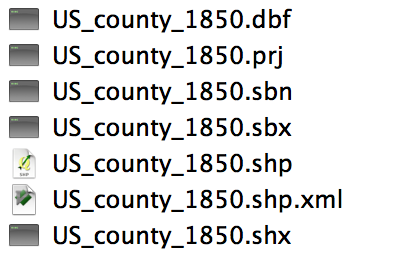
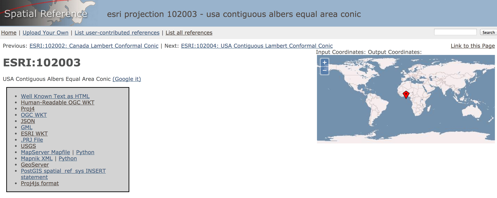

# Working with Shapefiles

There are several formats in which geographic data (especially data for boundaries) might come, but the most common format in the [shapefile](http://en.wikipedia.org/wiki/Shapefile). The format of shapefiles is controlled by Esri, a corporation that makes ArcGIS. The format, however, is widely used. Shapefiles can contain coordinates in latitude and longitude, but they can also contain projected coordinates in some other coordinate reference system which translates the coordinates on a three-dimensional globe to coordinates on a two-dimensional representation. For example, the coordinates of New Haven, Connecticut, in latitude and longitude are `41.3100° N, 72.9236° W`. In the popular coordinate reference system used by Google Maps and most other web mapping services, called Google Mercator, those coordinates would be represented as `-8117860.8230976425 5058258.564581587` (notice that longitude comes first, then latitude, and that the unit of measurement is not degrees but meters). While R can handle converting between coordinate reference systems using the [rgdal](http://cran.rstudio.org/web/packages/rgdal/) package, it is often easier to handle the conversion outside of R. Furthermore, shapefiles can often be enormous---in the hundreds of megabytes---because they contain much more detail about borders or coastlines than will appear in a an actual map. Simplifying these shapefiles is often a task better done outside of R, though many of the tasks can be done inside R as well. This chapter will explain how to reproject and simplify shapefiles gathered from the NHGIS website for use with [ggplot2](http://cran.rstudio.org/web/packages/ggplot2/). This pattern should be generalizable for most shapefiles.

## Installing external programs

We will use two external programs to work with shapefiles. The first is `ogr*` family of programs in [GDAL/OGR](http://www.gdal.org/). The second is [mapshaper](https://github.com/mbloch/mapshaper), which depends on Node.js.

### Installing on Mac

To install these programs on a Mac, run the following commands (assuming you use Homebrew).

```
brew update
brew install gdal
brew install node
```

You can then install mapshaper globally by running the following commands.

```
npm update
npm install -g mapshaper
```

### Installing on Ubuntu

To install these programs on Ubuntu, run the following commands.

```
apt-get update
apt-get install gdal-bin libgdal-dev libproj-dev
apt-get install nodejs
```

Then run the following command to install mapshaper.

```
npm update
npm install -g mapshaper
```

## Getting information about a shapefile

You can download a shapefile from the [NHGIS](https://www.nhgis.org/). For this example, we will use the shapefile of U.S. counties in 1850. 

When you unzip the directory which contains the shapefile, you will notice that it actually contains several files. The file that ends `.shp` is the shapefile itself, but the other files are important too. The file that ends `.prj` contains the projection information for the shapefile, and the file that ends `.dbf` contains the attributes associated with the polygons or points or lines in the shapefile. (R will let you read in this DBF file on its own if you just want that data.)



We can see what kind of information is available in the shapefile using the command `ogrinfo`with some flags that tell the command to give us all the information in the file. Assuming you are in your terminal in the same directory as the shapefile, you can run the following command.

```
ogrinfo -so -al US_county_1850.shp
```

This command will return a lot of information:

```
INFO: Open of `US_county_1850.shp'
      using driver `ESRI Shapefile' successful.

Layer name: US_county_1850
Geometry: Polygon
Feature Count: 1632
Extent: (-2356113.743199, -1337508.077280) - (2258224.796357, 1565781.659379)
Layer SRS WKT:
PROJCS["USA_Contiguous_Albers_Equal_Area_Conic",
    GEOGCS["GCS_North_American_1983",
        DATUM["North_American_Datum_1983",
            SPHEROID["GRS_1980",6378137.0,298.257222101]],
        PRIMEM["Greenwich",0.0],
        UNIT["Degree",0.0174532925199433]],
    PROJECTION["Albers_Conic_Equal_Area"],
    PARAMETER["False_Easting",0.0],
    PARAMETER["False_Northing",0.0],
    PARAMETER["longitude_of_center",-96.0],
    PARAMETER["Standard_Parallel_1",29.5],
    PARAMETER["Standard_Parallel_2",45.5],
    PARAMETER["latitude_of_center",37.5],
    UNIT["Meter",1.0]]
DECADE: String (4.0)
NHGISNAM: String (50.0)
NHGISST: String (3.0)
NHGISCTY: String (4.0)
ICPSRST: String (3.0)
ICPSRCTY: String (4.0)
ICPSRNAM: String (35.0)
STATENAM: String (25.0)
ICPSRSTI: Integer (10.0)
ICPSRCTYI: Integer (10.0)
ICPSRFIP: Real (17.5)
STATE: String (3.0)
COUNTY: String (4.0)
PID: Real (19.8)
X_CENTROID: Real (19.8)
Y_CENTROID: Real (19.8)
GISJOIN: String (8.0)
GISJOIN2: String (7.0)
SHAPE_AREA: Real (19.11)
SHAPE_LEN: Real (19.11)
```

This output tells us that the file contains polygons instead of points or lines (`Geometry: Polygon`) and that there are 1,632 polygons in the file (`Feature Count: 1632`). We can also see that the file is projected in using an [Albers equal area projection](http://en.wikipedia.org/wiki/Albers_projection). That is a fine choice for a projection, but it will make working with the shapefile in R more difficult. The output also tells us the variables associated with each polygon, such as `STATE` and `COUNTY`. In this file the information is mostly identification of the polygons, but other shapefiles will contain actual data. Note that we could obtain the same information in R by using the [rgdal](http://cran.rstudio.org/web/packages/rgdal/) wrapper around the `ogrinfo` command. The `ogrInfo()` function takes two arguments: the path to the directory with the shapefile, and the name of the shapefile without the `.shp` extension.

```{r}
library(rgdal)
ogrInfo("data/county-shapefile/", "US_county_1850")
```

## Reprojecting a shapefile

Next we want to reproject that shapefile into something more useable in R. There are many coordinate reference systems (CRS) or [spatial reference systems](http://en.wikipedia.org/wiki/Spatial_reference_system) (SRS), which are formal ways of describing the mathematics of a projection. These CRSes are usually defined either by a [Well-Known Text](http://en.wikipedia.org/wiki/Well-known_text) (WKT) or by a [Proj4](http://en.wikipedia.org/wiki/PROJ.4) string. Notice that the output of the `ogrinfo` command line tool gave us the WKT representation:

```
Layer SRS WKT:
PROJCS["USA_Contiguous_Albers_Equal_Area_Conic",
    GEOGCS["GCS_North_American_1983",
        DATUM["North_American_Datum_1983",
            SPHEROID["GRS_1980",6378137.0,298.257222101]],
        PRIMEM["Greenwich",0.0],
        UNIT["Degree",0.0174532925199433]],
    PROJECTION["Albers_Conic_Equal_Area"],
    PARAMETER["False_Easting",0.0],
    PARAMETER["False_Northing",0.0],
    PARAMETER["longitude_of_center",-96.0],
    PARAMETER["Standard_Parallel_1",29.5],
    PARAMETER["Standard_Parallel_2",45.5],
    PARAMETER["latitude_of_center",37.5],
    UNIT["Meter",1.0]]
```

But the `ogrInfo()` R function gave us the Proj4 string:

```
+proj=aea +lat_1=29.5 +lat_2=45.5 +lat_0=37.5 +lon_0=-96 +x_0=0 +y_0=0 +datum=NAD83 +units=m +no_defs
```

These are essentially interchangable, though sometimes functions or programs will expect one rather than the other. There are formal systems provided by ESRI, EPSG, and other organizations which provide identifying numbers to these projections. The best guide to these coordinate reference systems is [Spatial Reference](http://spatialreference.org/), which will list the common names, authority names and numbers, well-known texts, Proj4 strings, and other modes of representing projections. Looking up the "[USA Contiguous Albers Equal Area Conic](http://spatialreference.org/ref/esri/usa-contiguous-albers-equal-area-conic/)" projection, we can find various information about the projection.^[The EPSG codes and their associated Proj4 strings are available as a data frame via the `make_EPSG()` function in rgdal.]



We want to convert the shapefile to [EPSG 4326](http://spatialreference.org/ref/epsg/4326/), a system which is useful because it is unprojected. That is, is will represents data points in latitude and longitude. We can do this at the command line using the program `ogr2ogr`. We will specify the SRS that we want to convert to (`-t_srs`) and the name of input and output files. Notice that the output file (here called `US_county_1850_epsg4326.shp`) comes before the name of the input file.

```
ogr2ogr -t_srs EPSG:4326 US_county_1850_epsg4326.shp US_county_1850.shp
```

We could also use [rgdal](http://cran.rstudio.org/web/packages/rgdal/) to reproject the file inside R. First we would have to load the shapefile using the function `readOGR()`. We can find its Proj4 string with the function `proj4string()`.

```{r}
sp <- readOGR("data/county-shapefile/", "US_county_1850")
proj4string(sp)
```

We can define a new projection using the `CRS()` function, which takes as its argument a Proj4 string. This new projection can be used as an argument in the `spTransform()` function, which does the reprojection. From Spatial Reference we can find that the Proj4 string we want is `+proj=longlat +ellps=WGS84 +datum=WGS84 +no_defs`.

```{r}
sp_epsg4326 <- spTransform(sp, CRS("+proj=longlat +ellps=WGS84 +datum=WGS84 +no_defs"))
proj4string(sp_epsg4326)
```

If we wished, we could then save the reprojected shapefile to disk using `writeOGR()` function.


